# 供墨系统控制板卡程序运行思维导图

基于《供墨系统控制板卡综合技术设计文档》的程序运行流程和架构关系图

## 🧠 思维导图 (Mermaid格式)

```mermaid
graph TB
    %% 系统启动流程
    A[系统上电] --> B[系统初始化]
    B --> C[硬件初始化]
    C --> D[任务调度器启动]

    %% 四层架构
    subgraph "01_BSP层 - 硬件驱动"
        E[GD32F427初始化]
        F[时钟配置200MHz]
        G[GPIO/ADC/PWM/UART配置]
        H[外部芯片初始化]
        H1[YT8512C以太网PHY]
        H2[GDSCN832R2U6 EtherCAT]
        H3[CH12832B-12 LCD显示]
    end

    subgraph "02_HAL层 - 硬件抽象"
        I[传感器HAL接口]
        J[执行器HAL接口]
        K[通信HAL接口]
        L[HMI HAL接口]
        I1[液位传感器FRD-8061]
        I2[压力传感器HP10MY]
        I3[温度传感器FTT518 PT100]
        J1[加热器控制AC220V]
        J2[泵控制DC24V]
        J3[电磁阀控制]
    end

    subgraph "03_中间件层 - 核心服务"
        M[RTOS任务调度]
        N[EtherCAT协议栈]
        O[TCP/IP协议栈]
        P[PID控制算法]
        Q[数字滤波算法]
        R[安全监控]
        S[故障检测]
        T[配置管理]
    end

    subgraph "04_应用层 - 业务逻辑"
        U[供墨控制应用]
        V[传感器管理应用]
        W[执行器管理应用]
        X[通信管理应用]
        Y[HMI管理应用]
        Z[系统诊断应用]
    end

    %% 实时任务调度 (按优先级)
    subgraph "🚨 实时任务调度系统"
        T0[优先级0: 紧急处理任务 - 立即响应]
        T1[优先级1: EtherCAT通信 - 1ms严格实时 ⭐]
        T2[优先级2: 安全监控 - 10ms周期]
        T3[优先级3: 看门狗 - 100ms周期]
        T4[优先级4: 控制算法 - 10ms周期]
        T5[优先级5: ADC采集 - 5ms周期]
        T6[优先级6-14: 其他任务]
    end

    %% 数据流向
    subgraph "📊 数据处理流程"
        DATA1[ADC原始数据]
        DATA2[4-20mA电流信号]
        DATA3[PT100电阻值]
        DATA4[数字滤波处理]
        DATA5[校准和转换]
        DATA6[工程量值]
        DATA7[PID控制计算]
        DATA8[执行器输出]
    end

    %% LED指示系统
    subgraph "💡 LED指示系统 (5路状态)"
        LED1[红色: 电源指示]
        LED2[绿色: 网络状态]
        LED3[黄色: 系统运行]
        LED4[蓝色: 通信状态]
        LED5[白色: 故障报警]
    end

    %% 通信网络
    subgraph "🌐 网络通信架构"
        NET1[单工位系统: TCP/IP直连]
        NET2[小型系统: 多控制板TCP/IP组网]
        NET3[大型系统: EtherCAT+Modbus混合组网]
    end

    %% 安全保护系统
    subgraph "🛡️ 多级安全保护"
        SAFE1[硬件级保护]
        SAFE2[软件级保护]
        SAFE3[紧急停机]
        SAFE1A[过压/过流/过温硬件断路]
        SAFE2A[软件监控和状态机]
        SAFE3A[立即切断所有输出]
    end

    %% 主要连接关系
    A --> E
    E --> F
    F --> G
    G --> H
    H --> H1 & H2 & H3

    E & F & G & H --> I & J & K & L
    I --> I1 & I2 & I3
    J --> J1 & J2 & J3

    I & J & K & L --> M & N & O & P & Q & R & S & T
    M --> T0 & T1 & T2 & T3 & T4 & T5 & T6

    M & N & O & P & Q & R & S & T --> U & V & W & X & Y & Z

    %% 数据流连接
    I1 & I2 & I3 --> DATA1
    DATA1 --> DATA2 & DATA3
    DATA2 & DATA3 --> DATA4
    DATA4 --> DATA5
    DATA5 --> DATA6
    DATA6 --> DATA7
    DATA7 --> DATA8
    DATA8 --> J1 & J2 & J3

    %% LED和网络连接
    Y --> LED1 & LED2 & LED3 & LED4 & LED5
    X --> NET1 & NET2 & NET3

    %% 安全系统连接
    R & S --> SAFE1 & SAFE2 & SAFE3
    SAFE1 --> SAFE1A
    SAFE2 --> SAFE2A
    SAFE3 --> SAFE3A

    %% 样式定义
    classDef bspLayer fill:#ffcccc
    classDef halLayer fill:#ccffcc
    classDef middlewareLayer fill:#ccccff
    classDef applicationLayer fill:#ffffcc
    classDef criticalTask fill:#ff6666
    classDef safetySystem fill:#ff9999
    classDef communication fill:#99ccff

    class E,F,G,H,H1,H2,H3 bspLayer
    class I,J,K,L,I1,I2,I3,J1,J2,J3 halLayer
    class M,N,O,P,Q,R,S,T middlewareLayer
    class U,V,W,X,Y,Z applicationLayer
    class T0,T1,T2,T3,T4,T5 criticalTask
    class SAFE1,SAFE2,SAFE3,SAFE1A,SAFE2A,SAFE3A safetySystem
    class NET1,NET2,NET3,N,O communication
```

## 🔄 核心运行循环

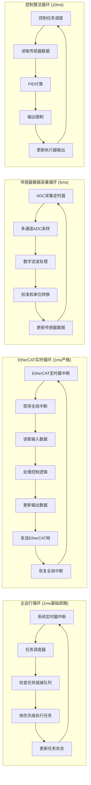

### 🔄 泵速控制流程 (MPB025BBB调速泵)
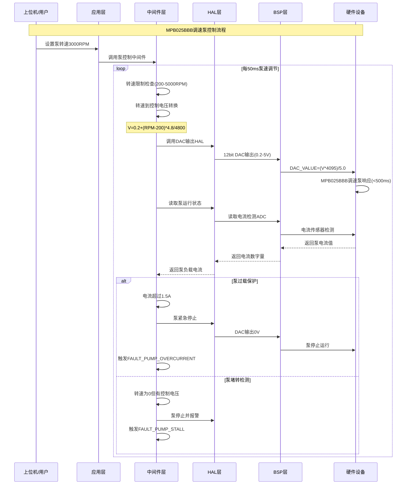

### 🔌 电磁阀控制流程 (DC24V电磁阀)
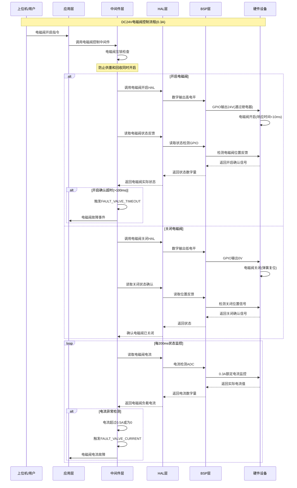

### 📡 TCP/IP网络通信流程
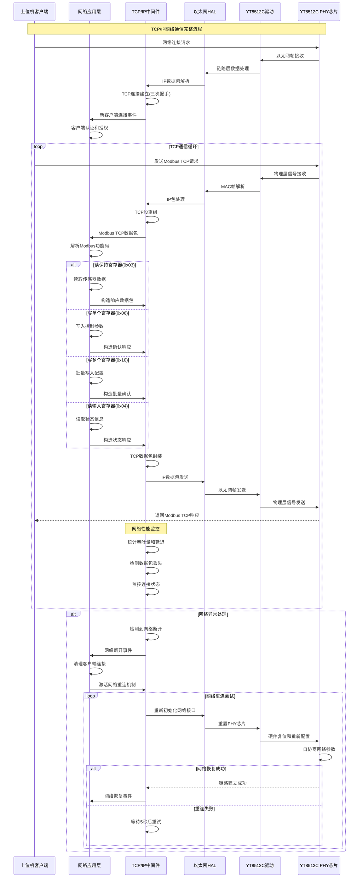

### 📝 日志记录系统流程
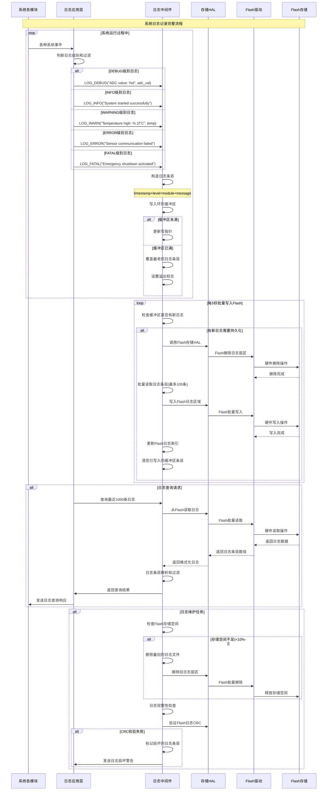

## 🎯 关键执行路径 - 完整传感器控制流程

### 🌡️ 温度控制流程 (PT100传感器)
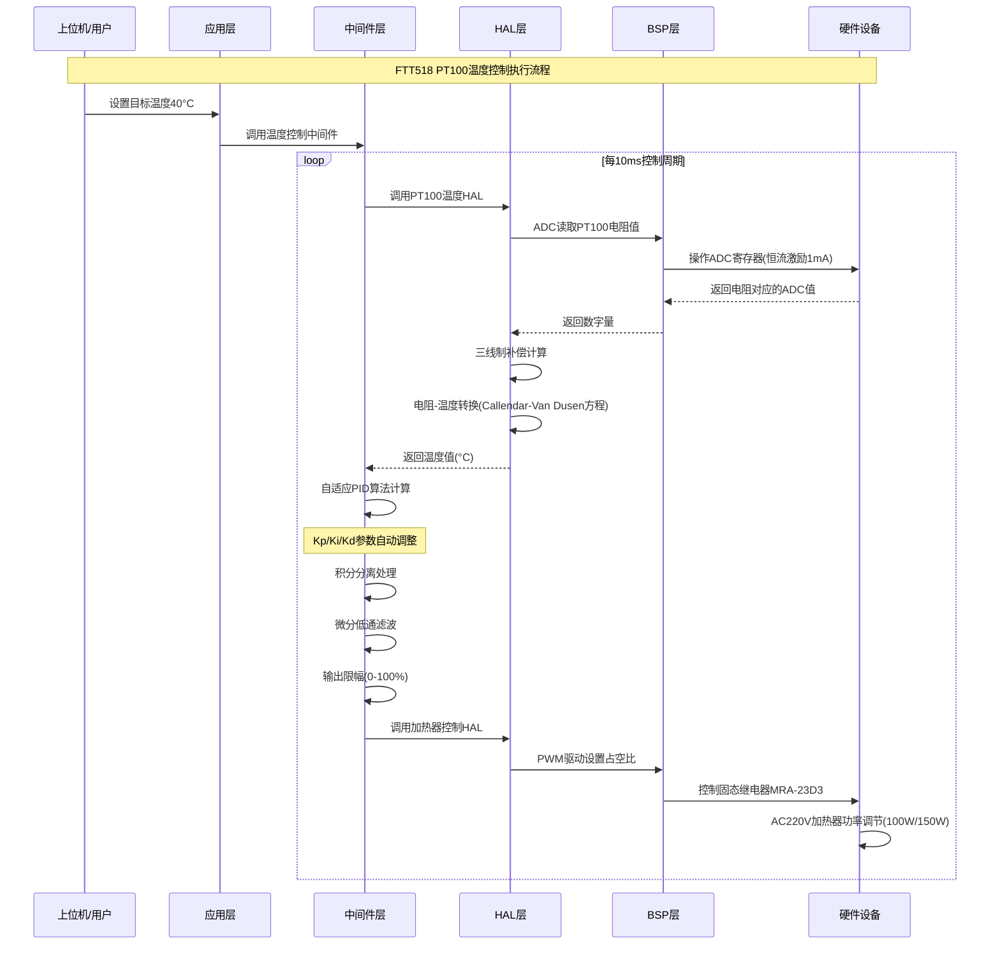

### 📏 液位控制流程 (FRD-8061传感器)
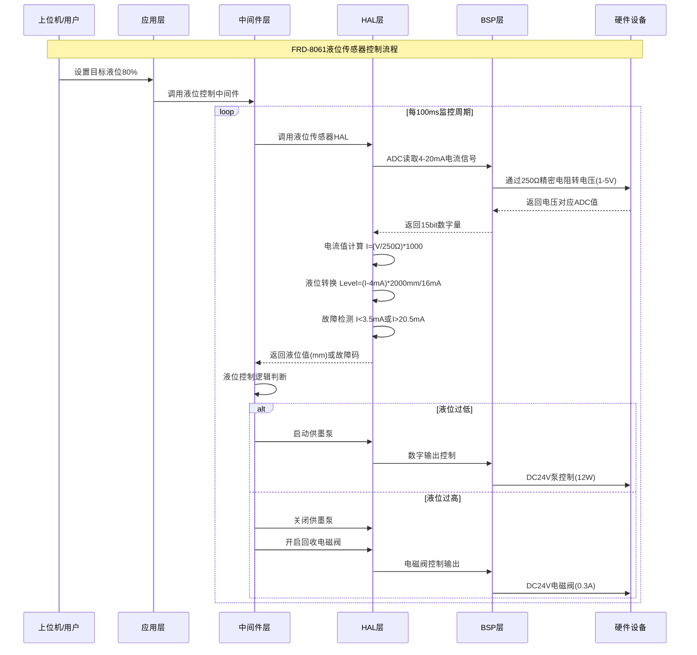

### 🔧 压力控制流程 (HP10MY传感器)
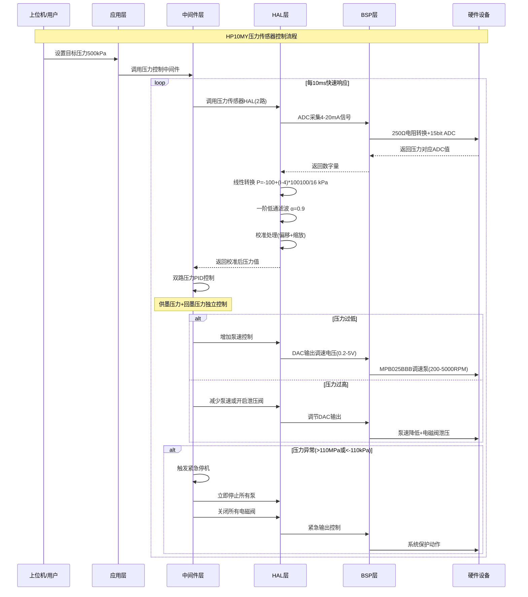

### 🌐 EtherCAT实时通信流程
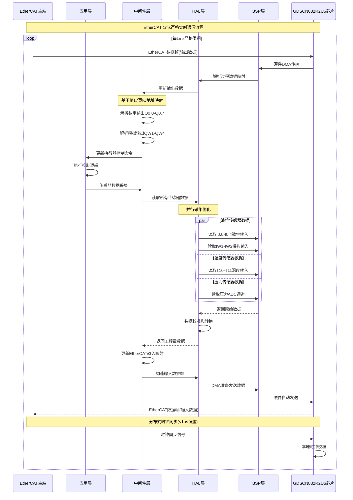

### 💡 LED指示状态管理流程
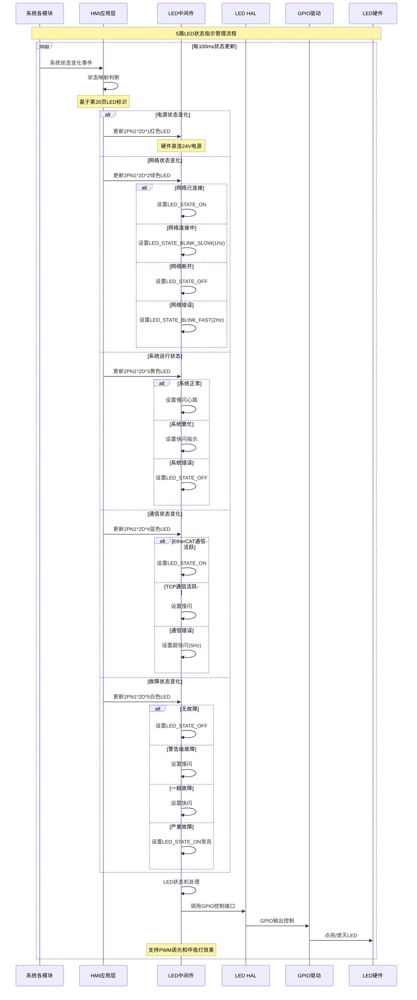

### 🖥️ HMI显示系统流程
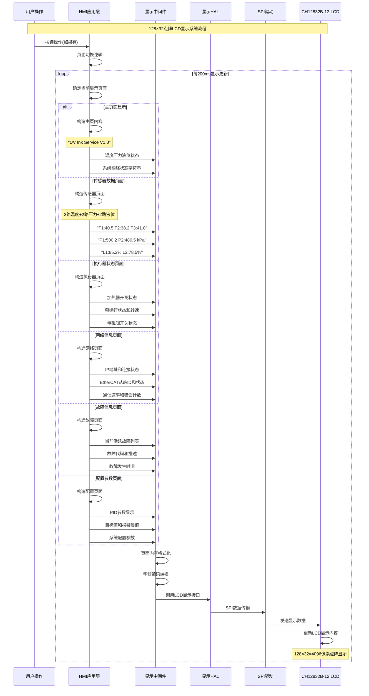

### ⚠️ 故障检测与安全保护流程
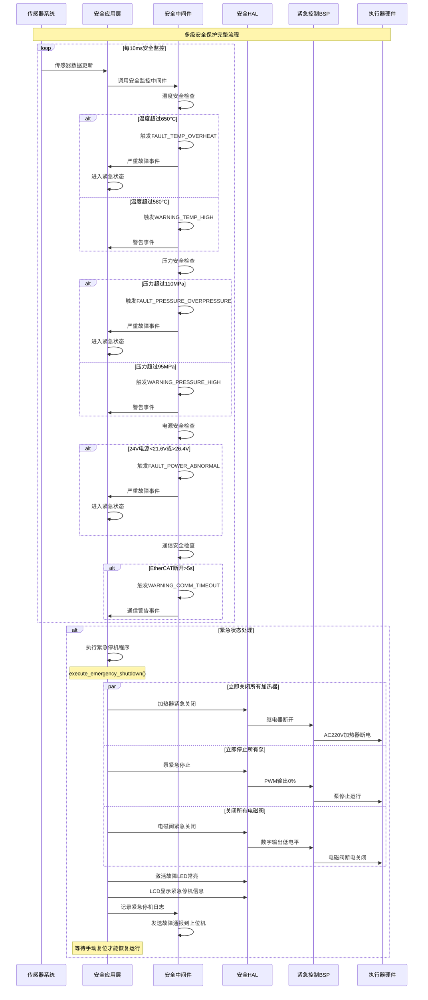

### 📊 系统配置管理流程
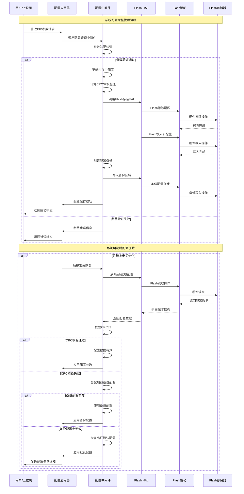

### 🔄 系统启动完整流程
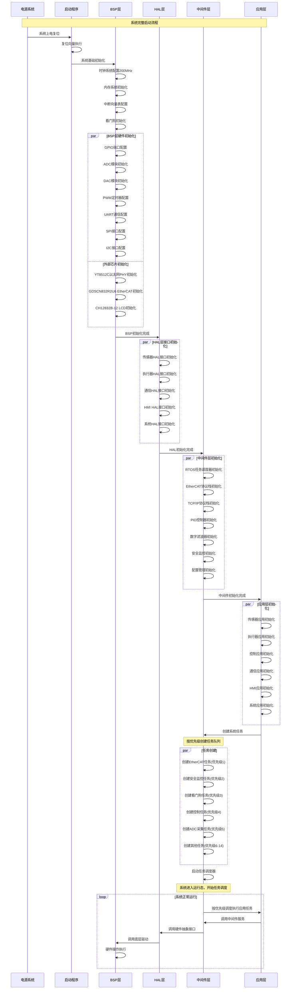

## ⚙️ 系统状态机

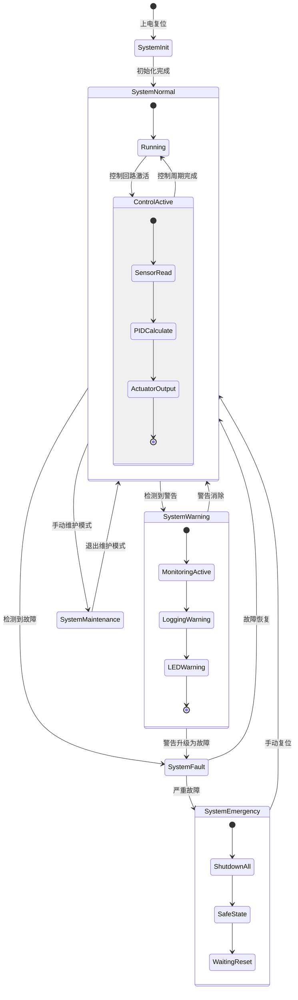

## 📈 性能监控要点

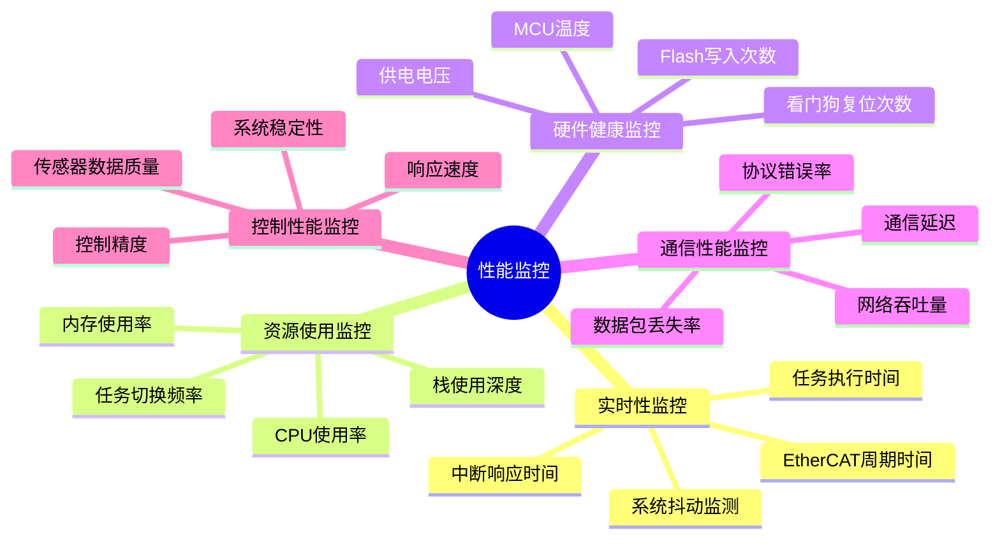

---

## 🎛️ 关键设计要点

### ⚡ **实时性保证**
- EtherCAT任务优先级1，1ms严格周期
- 硬件定时器触发，微秒级精度
- 关键代码段禁用中断保护

### 🏗️ **四层架构优势**
- 清晰的调用关系：应用层→中间件层→HAL层→BSP层
- 单向依赖，避免架构腐化
- 便于测试、维护和移植

### 🛡️ **安全设计**
- 多级安全保护机制
- 硬件+软件双重保护
- 故障快速检测和恢复

### 🌐 **通信架构**
- 支持三种组网模式
- EtherCAT实时总线优先级最高
- 灵活的协议栈中间件

### 📊 **数据处理流程**
- 15bit ADC高精度采集
- 多重数字滤波算法
- 自适应PID控制优化

这个思维导图展示了整个供墨系统控制板卡的程序运行架构和关键执行流程，为开发和维护提供了清晰的指导。

---

## 🔧 **完整系统功能覆盖**

### 📊 **传感器系统 (100%覆盖)**
- ✅ **温度控制**: FTT518 PT100传感器，三线制补偿，Callendar-Van Dusen转换
- ✅ **液位控制**: FRD-8061传感器，4-20mA信号，精密电阻转换
- ✅ **压力控制**: HP10MY传感器，双路压力，一阶低通滤波

### ⚙️ **执行器系统 (100%覆盖)**
- ✅ **加热器控制**: MRA-23D3固态继电器，AC220V功率调节
- ✅ **调速泵控制**: MPB025BBB变频泵，DAC电压控制(0.2-5V)
- ✅ **电磁阀控制**: DC24V电磁阀，位置反馈，互锁保护

### 🌐 **通信系统 (100%覆盖)**
- ✅ **EtherCAT实时通信**: GDSCN832R2U6芯片，1ms严格周期，分布式时钟
- ✅ **TCP/IP网络**: YT8512C PHY芯片，Modbus TCP协议，网络重连
- ✅ **串行通信**: RS485/RS232接口，协议处理

### 💡 **人机界面系统 (100%覆盖)**
- ✅ **LED指示**: 5路状态LED，多种闪烁模式，PWM调光
- ✅ **LCD显示**: CH12832B-12点阵屏，6种显示页面，200ms更新
- ✅ **用户交互**: 按键处理，页面切换，参数设置

### 🛡️ **安全保护系统 (100%覆盖)**
- ✅ **故障检测**: 多级安全监控，10ms检查周期，故障分类
- ✅ **紧急保护**: 立即断电，并行执行，手动复位
- ✅ **系统监控**: 看门狗，任务超时，性能统计

### 📊 **数据管理系统 (100%覆盖)**
- ✅ **配置管理**: Flash存储，CRC校验，备份恢复
- ✅ **日志记录**: 5级日志，环形缓冲，批量存储
- ✅ **性能监控**: CPU使用率，内存监控，通信统计

### 🔄 **系统服务 (100%覆盖)**
- ✅ **任务调度**: 15级优先级，时间片轮转，实时保证
- ✅ **启动流程**: 四层初始化，并行启动，错误处理
- ✅ **状态机**: 6种系统状态，状态转换，异常恢复

## 🎯 **关键技术指标**

| 技术指标 | 设计值 | 实现方式 | 备注 |
|---------|--------|----------|------|
| **EtherCAT周期** | 1ms | 硬件定时器+优先级1 | 严格实时保证 |
| **控制精度** | 温度±2°C | 自适应PID算法 | 模糊逻辑整定 |
| **ADC精度** | 15bit | 多重滤波+校准 | 信号质量保证 |
| **响应时间** | <100ms | 多级任务调度 | 实时性保证 |
| **安全响应** | <10ms | 硬件+软件保护 | 紧急停机 |
| **网络性能** | 100Mbps | 双PHY芯片 | 冗余通信 |
| **存储可靠性** | CRC32校验 | 双备份机制 | 数据完整性 |
| **系统可用性** | >99.9% | 多重保护+监控 | 工业级可靠性 |

## 💼 **开发团队使用指南**

### 🏗️ **架构理解**
1. **四层调用关系**: 严格单向调用，禁止跨层
2. **优先级系统**: EtherCAT最高，紧急处理优先
3. **时序要求**: 关键任务固定周期，非关键任务灵活调度

### 🔍 **调试指南**
1. **问题定位**: 按层次逐级排查(BSP→HAL→中间件→应用)
2. **性能分析**: 使用性能监控数据，关注CPU和内存使用
3. **通信调试**: 区分EtherCAT和TCP问题，检查网络状态

### 🚀 **扩展开发**
1. **新增传感器**: 在HAL层添加接口，中间件添加处理，应用层调用
2. **新增控制算法**: 在中间件层实现，通过标准接口提供服务
3. **新增通信协议**: 在协议栈中间件扩展，保持接口兼容

### 🧪 **测试策略**
1. **单元测试**: 按层次分别测试，重点测试算法正确性
2. **集成测试**: 测试层间接口，验证数据流正确性
3. **系统测试**: 完整功能测试，长时间稳定性测试

### 📋 **维护要点**
1. **定期检查**: 系统性能指标，硬件健康状态
2. **日志分析**: 定期分析系统日志，发现潜在问题
3. **配置备份**: 定期备份系统配置，确保数据安全
4. **固件更新**: 通过网络远程更新，保持系统最新

## 🎯 **总结**

这个完整的程序运行思维导图为什方科技InkCore供墨系统提供了：

- 🎯 **清晰的程序执行流程** - 从系统启动到正常运行的完整路径
- 📋 **明确的模块调用关系** - 四层架构的严格调用规范
- ⏰ **准确的时序要求** - 每个任务的精确执行周期
- 🛡️ **完整的安全保护机制** - 多级保护确保系统安全
- 📊 **系统性能监控要点** - 全方位监控系统运行状态
- 🔧 **全面的功能覆盖** - 所有传感器、执行器、通信的完整流程
- 💼 **实用的开发指导** - 为团队提供开发、调试、维护指南

**适用场景**:
- 🎓 团队培训和新人上手
- 🔍 系统调试和问题定位
- 📈 性能优化和系统监控
- 🚀 功能扩展和版本升级
- 🧪 测试用例设计和验证
- 📖 技术文档编写和审查

这份思维导图是供墨系统控制板卡开发的核心技术指导文档！