# 上位机交互流程文档

## 版本信息
- **版本**: V4.0
- **日期**: 2025-09-27
- **项目**: ink_supply_system_gd32f427
- **标准**: 8周v4标准

## 1. 文档概述

本文档详细描述了供墨系统与上位机的交互流程，包括不同协议的交互序列、状态机设计、数据交换模式和系统集成方案。与通信协议规范文档配合使用，为上位机软件开发提供完整的交互指导。

## 2. 系统交互架构

### 2.1 交互架构图

```
┌─────────────────┐    ┌─────────────────┐    ┌─────────────────┐
│   EtherCAT      │    │    Modbus       │    │    Custom       │
│   上位机        │    │    上位机       │    │    TCP上位机    │
└─────────────────┘    └─────────────────┘    └─────────────────┘
         │                       │                       │
         │ EtherCAT             │ Modbus TCP            │ TCP/IP
         │ 1ms周期              │ 100ms周期             │ 50ms周期
         │                      │                       │
         └──────────────────────┼───────────────────────┘
                                │
         ┌─────────────────────────────────────────────┐
         │          供墨系统控制器                      │
         │         (GD32F427VGT6)                     │
         │                                            │
         │  ┌─────────────┐ ┌─────────────┐ ┌─────────┐ │
         │  │   EtherCAT  │ │   Modbus    │ │  TCP    │ │
         │  │   从站      │ │   从站      │ │ 服务器  │ │
         │  └─────────────┘ └─────────────┘ └─────────┘ │
         │            │            │            │       │
         │  ┌─────────────────────────────────────────┐ │
         │  │          通信任务管理器                 │ │
         │  └─────────────────────────────────────────┘ │
         │            │            │            │       │
         │  ┌─────────┐ ┌─────────┐ ┌─────────┐ ┌─────┐ │
         │  │ 传感器  │ │ 控制器  │ │ 执行器  │ │安全 │ │
         │  │ 任务    │ │ 任务    │ │ 任务    │ │任务 │ │
         │  └─────────┘ └─────────┘ └─────────┘ └─────┘ │
         └─────────────────────────────────────────────┘
```

### 2.2 交互层次结构

```
应用层交互 (上位机软件)
    ↕
协议层交互 (EtherCAT/Modbus/TCP)
    ↕
传输层交互 (以太网物理层)
    ↕
设备层交互 (供墨系统控制器)
```

## 3. EtherCAT交互流程

### 3.1 EtherCAT启动序列

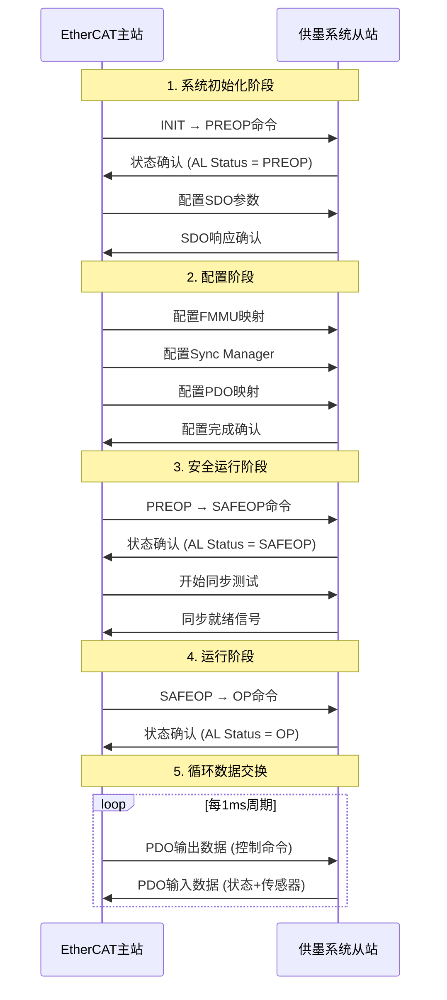

### 3.2 EtherCAT异常处理流程

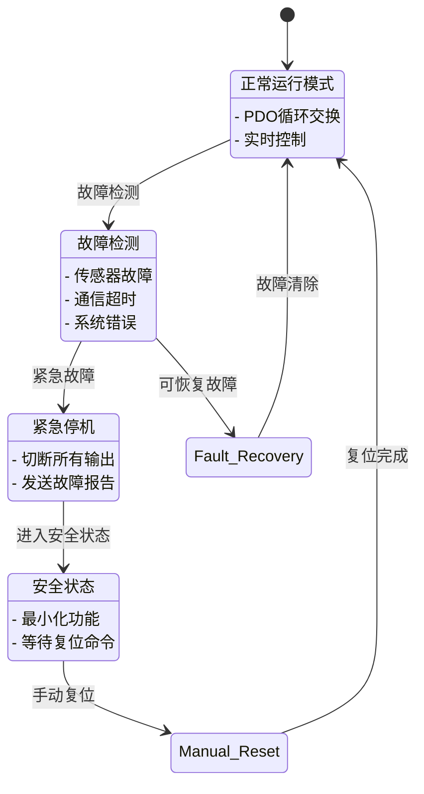

### 3.3 EtherCAT数据交换时序

```
时间轴 (1ms周期):
    0μs     250μs    500μs    750μs    1000μs
     │        │        │        │         │
     ├────────┼────────┼────────┼─────────┤
     │ PDO TX │ 处理   │ PDO RX │  等待    │ 下个周期
     │ 发送   │ 数据   │ 接收   │  同步    │
     │        │        │        │         │

详细时序:
- 0-50μs:    接收上位机控制命令
- 50-200μs:  数据处理和控制算法执行
- 200-250μs: 准备发送数据
- 250-300μs: 发送状态和传感器数据
- 300-1000μs: 空闲时间，用于其他任务
```

## 4. Modbus交互流程

### 4.1 Modbus连接建立流程

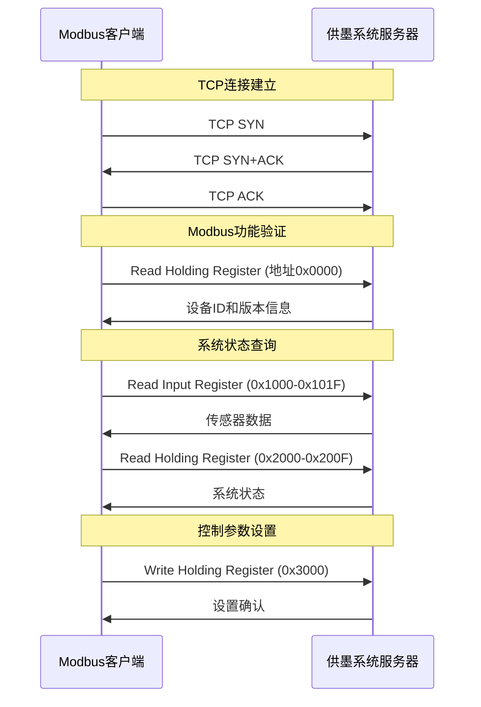

### 4.2 Modbus数据轮询模式

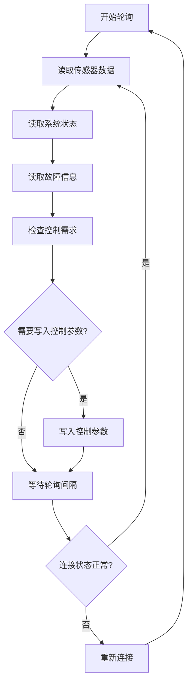

### 4.3 Modbus异常响应处理

```
异常代码处理流程:

01 (非法功能码)
├── 记录错误日志
├── 返回异常响应
└── 继续处理其他请求

02 (非法数据地址)
├── 检查地址范围
├── 返回异常响应
└── 建议正确地址范围

03 (非法数据值)
├── 检查数据范围和格式
├── 返回异常响应
└── 提供有效数据范围

04 (从站设备故障)
├── 触发系统自检
├── 返回异常响应
├── 记录故障信息
└── 通知上位机故障详情

06 (从站忙)
├── 返回异常响应
├── 建议重试延时
└── 优先处理高优先级请求
```

## 5. 自定义TCP交互流程

### 5.1 TCP连接管理流程

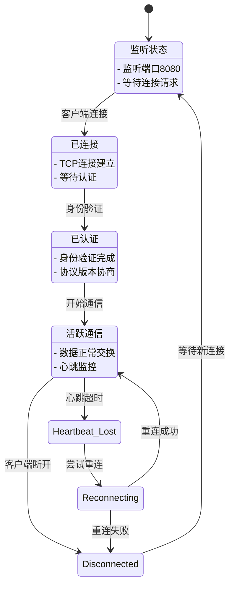

### 5.2 自定义协议消息流程

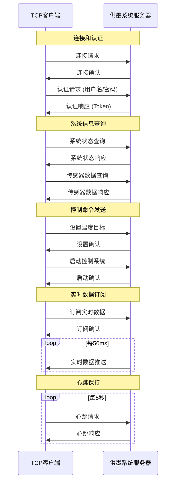

### 5.3 数据推送和订阅机制

```
数据推送流程:

1. 客户端订阅
   ├── 发送订阅请求
   ├── 指定数据类型和频率
   └── 接收订阅确认

2. 服务器处理
   ├── 验证客户端权限
   ├── 检查系统资源
   ├── 建立推送队列
   └── 启动推送定时器

3. 数据推送
   ├── 采集最新数据
   ├── 打包数据帧
   ├── 发送数据
   └── 检查客户端响应

4. 异常处理
   ├── 网络中断 → 暂停推送
   ├── 缓冲区满 → 丢弃旧数据
   ├── 客户端无响应 → 断开连接
   └── 系统过载 → 降低推送频率
```

## 6. 多协议并发交互

### 6.1 协议优先级管理

```
优先级层次 (高到低):
1. EtherCAT实时控制    - 最高优先级，1ms严格实时
2. 安全紧急停机       - 紧急优先级，立即响应
3. TCP控制命令        - 高优先级，50ms响应
4. Modbus状态查询     - 中等优先级，100ms响应
5. 系统诊断和维护     - 低优先级，1s响应

资源分配策略:
├── CPU时间片分配: EtherCAT(40%) + TCP(30%) + Modbus(20%) + 其他(10%)
├── 内存缓冲区: 独立缓冲区避免冲突
├── 网络带宽: 动态QoS管理
└── 中断优先级: EtherCAT > 安全 > TCP > Modbus
```

### 6.2 协议冲突处理

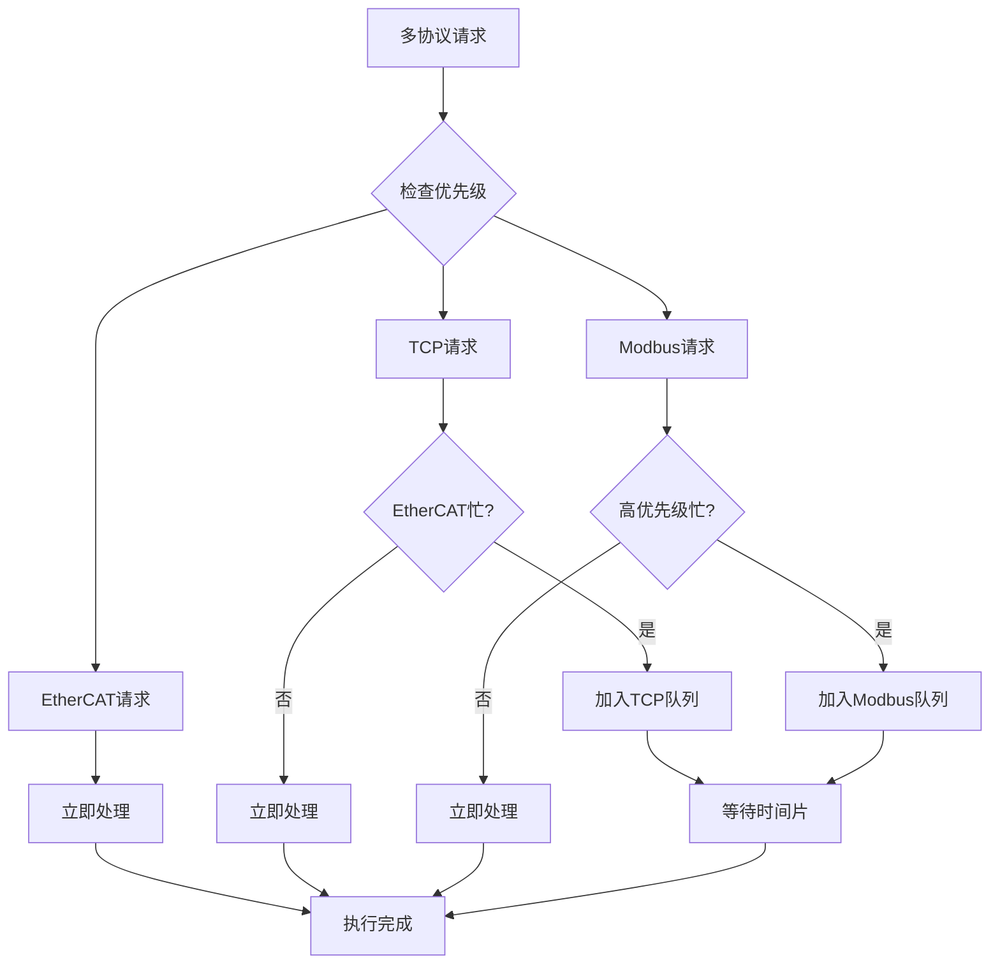

### 6.3 数据一致性保证

```
数据同步机制:

1. 原子操作保护
   ├── 关键数据结构使用互斥锁
   ├── 读写操作原子化
   └── 避免数据竞争

2. 数据版本控制
   ├── 每次更新增加版本号
   ├── 客户端检查版本一致性
   └── 版本冲突时重新获取

3. 缓存管理
   ├── 每种协议独立缓存
   ├── 定期同步缓存数据
   └── 缓存过期自动刷新

4. 事务处理
   ├── 批量操作事务化
   ├── 失败时回滚状态
   └── 确保数据完整性
```

## 7. 状态机和流程控制

### 7.1 系统全局状态机

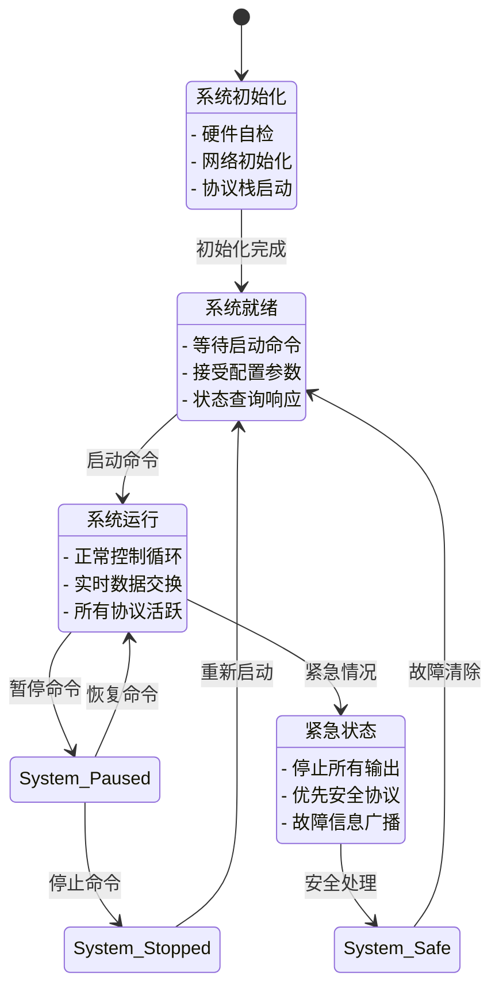

### 7.2 通信状态机

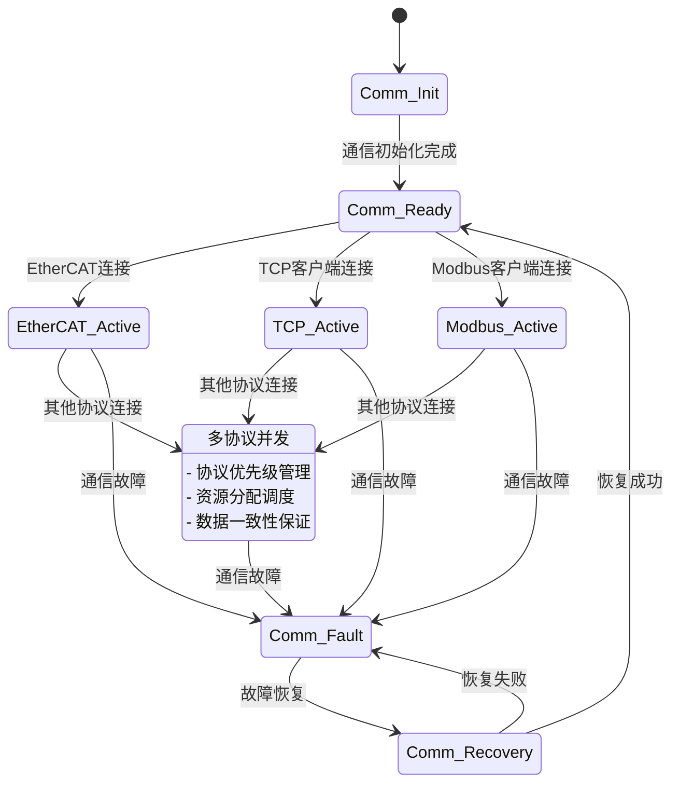

## 8. 性能监控和诊断

### 8.1 性能指标监控

```
实时性能监控指标:

1. EtherCAT性能
   ├── 循环时间: ≤1ms (目标: 0.8ms)
   ├── 抖动: ≤10μs
   ├── 丢包率: ≤0.01%
   └── 同步精度: ≤1μs

2. TCP性能
   ├── 响应时间: ≤50ms
   ├── 吞吐量: ≥1Mbps
   ├── 并发连接: ≤10个
   └── 重连次数: 监控统计

3. Modbus性能
   ├── 查询响应时间: ≤100ms
   ├── 成功率: ≥99.9%
   ├── 异常响应率: ≤0.1%
   └── 超时次数: 监控统计

4. 系统资源
   ├── CPU使用率: ≤80%
   ├── 内存使用率: ≤70%
   ├── 网络带宽: 监控使用情况
   └── 任务响应时间: 各任务独立监控
```

### 8.2 诊断和调试接口

```
诊断功能实现:

1. 通信诊断
   ├── 协议层统计信息
   ├── 错误计数和分类
   ├── 性能指标历史
   └── 网络状态检测

2. 系统诊断
   ├── 任务运行状态
   ├── 资源使用情况
   ├── 硬件状态检查
   └── 内存泄漏检测

3. 远程调试
   ├── 日志远程查看
   ├── 参数在线调整
   ├── 状态实时监控
   └── 远程重启功能

4. 故障分析
   ├── 故障事件记录
   ├── 故障模式识别
   ├── 根因分析辅助
   └── 预防性维护建议
```

## 9. 安全和认证机制

### 9.1 安全层次结构

```
安全防护层次:

1. 物理安全
   ├── 硬件防护
   ├── 访问控制
   └── 环境监控

2. 网络安全
   ├── 防火墙规则
   ├── 网络分段
   ├── 流量监控
   └── 入侵检测

3. 协议安全
   ├── 数据加密 (AES-256)
   ├── 消息认证 (HMAC)
   ├── 重放攻击防护
   └── 完整性校验

4. 应用安全
   ├── 用户身份验证
   ├── 权限管理
   ├── 操作日志
   └── 安全审计
```

### 9.2 认证流程

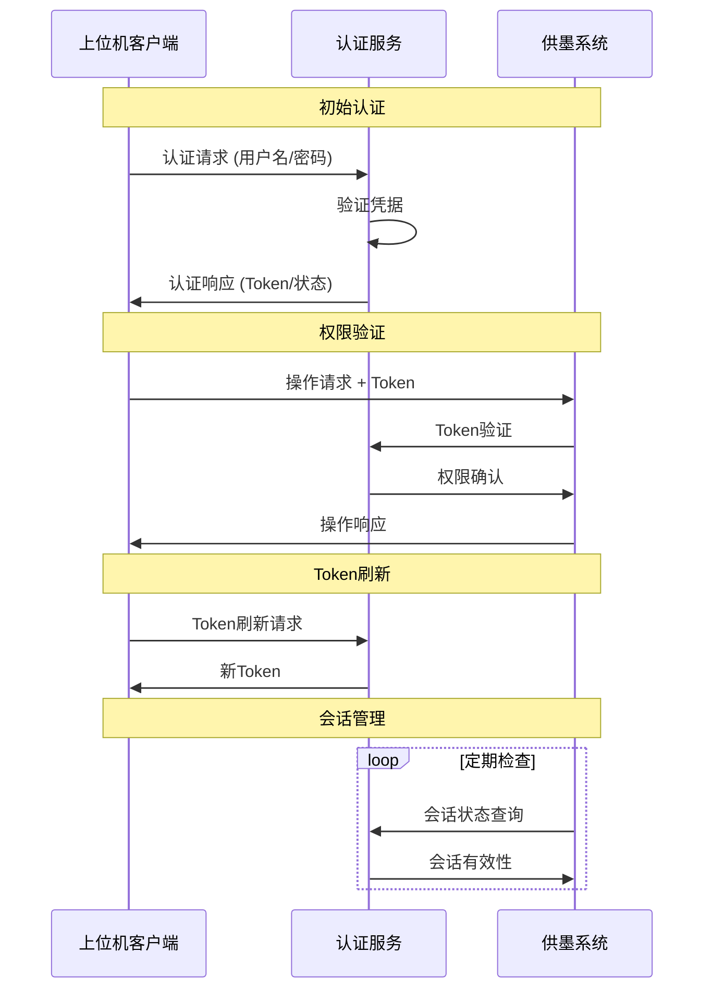

## 10. 错误处理和恢复策略

### 10.1 错误分类和处理

```
错误分类处理策略:

1. 通信错误
   ├── 网络连接中断
   │   ├── 自动重连 (最多3次)
   │   ├── 降级服务
   │   └── 报告故障状态
   ├── 协议解析错误
   │   ├── 丢弃错误帧
   │   ├── 请求重传
   │   └── 记录错误日志
   └── 超时错误
       ├── 增加超时时间
       ├── 检查网络状态
       └── 重新建立连接

2. 系统错误
   ├── 内存不足
   │   ├── 清理缓存
   │   ├── 暂停低优先级任务
   │   └── 报告资源不足
   ├── 任务异常
   │   ├── 任务重启
   │   ├── 状态恢复
   │   └── 异常上报
   └── 硬件故障
       ├── 切换备用路径
       ├── 安全模式运行
       └── 维护提醒

3. 数据错误
   ├── 校验失败
   │   ├── 请求重传
   │   ├── 使用历史数据
   │   └── 错误标记
   ├── 格式错误
   │   ├── 数据转换
   │   ├── 默认值填充
   │   └── 格式修正
   └── 范围错误
       ├── 数据截断
       ├── 边界处理
       └── 告警通知
```

### 10.2 系统恢复流程

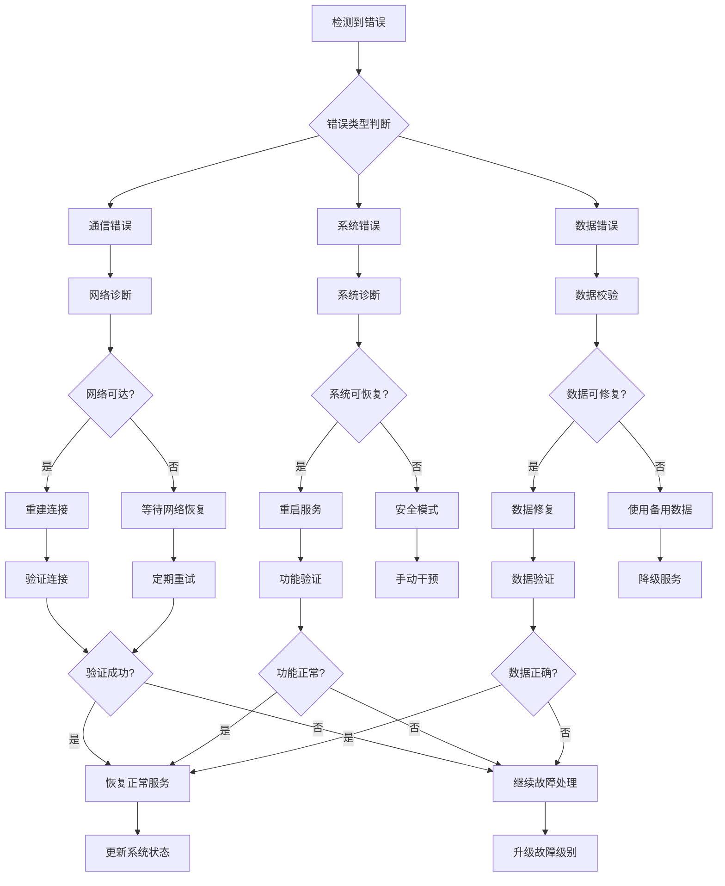

## 11. 集成测试和验证

### 11.1 测试场景设计

```
测试场景分类:

1. 功能测试
   ├── 基本连接测试
   ├── 数据交换测试
   ├── 控制命令测试
   └── 状态查询测试

2. 性能测试
   ├── 响应时间测试
   ├── 吞吐量测试
   ├── 并发连接测试
   └── 长时间稳定性测试

3. 兼容性测试
   ├── 不同上位机软件
   ├── 不同网络环境
   ├── 不同操作系统
   └── 协议版本兼容

4. 异常测试
   ├── 网络中断测试
   ├── 电源断电测试
   ├── 数据损坏测试
   └── 恶意攻击测试

5. 压力测试
   ├── 高频数据请求
   ├── 大量并发连接
   ├── 长时间运行
   └── 资源耗尽场景
```

### 11.2 自动化测试框架

```
自动化测试架构:

测试控制器
├── 测试用例管理
├── 测试执行引擎
├── 结果分析器
└── 报告生成器

模拟器群
├── EtherCAT主站模拟器
├── Modbus客户端模拟器
├── TCP客户端模拟器
└── 网络环境模拟器

监控系统
├── 性能监控器
├── 错误检测器
├── 日志收集器
└── 数据分析器

结果验证
├── 功能正确性验证
├── 性能指标验证
├── 异常处理验证
└── 安全性验证
```

## 12. 部署和维护指南

### 12.1 部署清单

```
部署前检查清单:

1. 硬件环境
   ├── 网络连接质量
   ├── 电源稳定性
   ├── 环境温湿度
   └── 电磁干扰检查

2. 软件环境
   ├── 固件版本确认
   ├── 配置参数设置
   ├── 安全证书部署
   └── 备份策略制定

3. 网络配置
   ├── IP地址分配
   ├── 路由表配置
   ├── 防火墙规则
   └── QoS策略设置

4. 上位机准备
   ├── 软件安装配置
   ├── 连接参数设置
   ├── 用户账户创建
   └── 权限分配管理
```

### 12.2 维护策略

```
定期维护任务:

日常维护 (每日)
├── 系统状态检查
├── 连接状态监控
├── 性能指标查看
└── 错误日志审查

周期维护 (每周)
├── 系统性能分析
├── 安全日志审计
├── 备份数据验证
└── 软件更新检查

月度维护 (每月)
├── 全面系统诊断
├── 性能趋势分析
├── 容量规划评估
└── 灾难恢复演练

年度维护 (每年)
├── 硬件设备检查
├── 安全策略审查
├── 系统架构优化
└── 升级计划制定
```

## 13. 总结

本文档全面描述了供墨系统与上位机的交互流程，涵盖了EtherCAT、Modbus TCP和自定义TCP三种主要通信协议的详细交互序列。通过状态机设计、错误处理机制、性能监控和安全认证等多个维度，为上位机软件开发和系统集成提供了完整的技术指导。

### 13.1 关键特性

- **多协议并发支持**: 同时支持三种通信协议，满足不同应用场景需求
- **实时性保证**: EtherCAT 1ms严格实时，TCP 50ms响应，Modbus 100ms响应
- **高可靠性**: 完善的错误处理和恢复机制，确保系统稳定运行
- **安全防护**: 多层次安全机制，保护系统免受恶意攻击
- **易于集成**: 标准化接口和详细文档，简化上位机软件开发

### 13.2 适用范围

本交互流程设计适用于：
- 工业自动化控制系统
- 分布式生产线管理
- 实时监控和数据采集
- 远程设备维护和诊断
- 企业级供墨系统集成

通过遵循本文档的交互流程设计，可以确保上位机与供墨系统之间的高效、稳定、安全的通信交互。