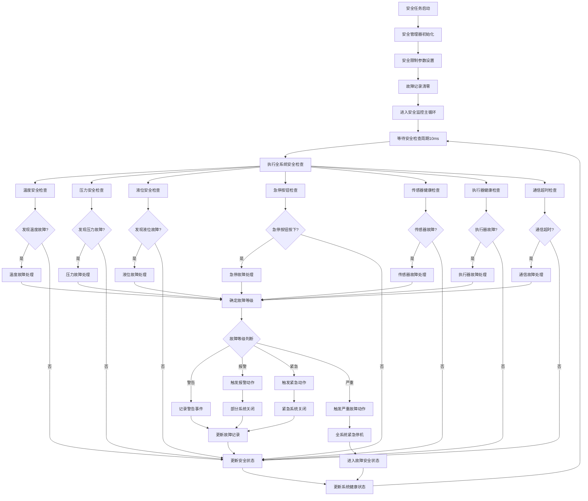
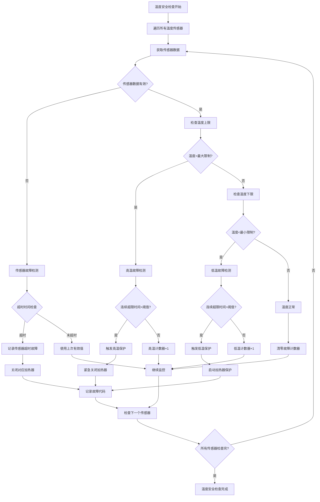
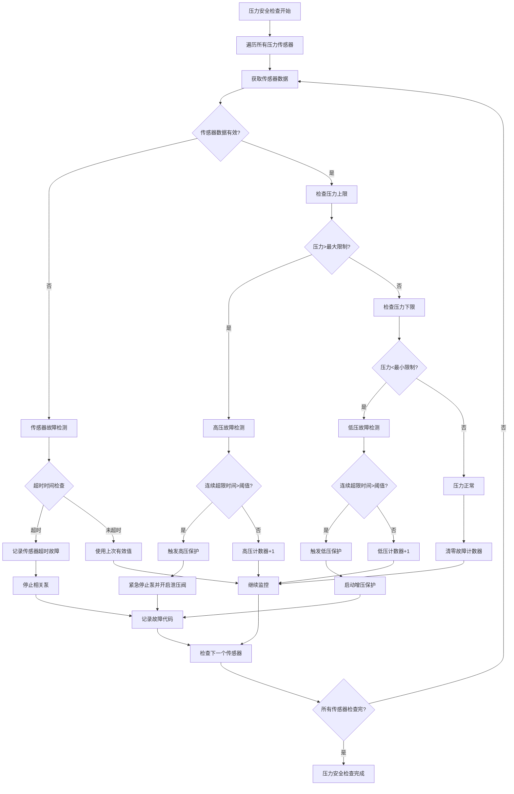
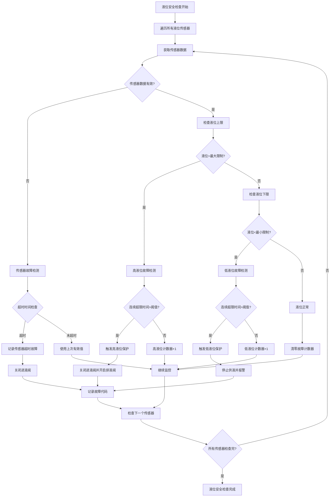
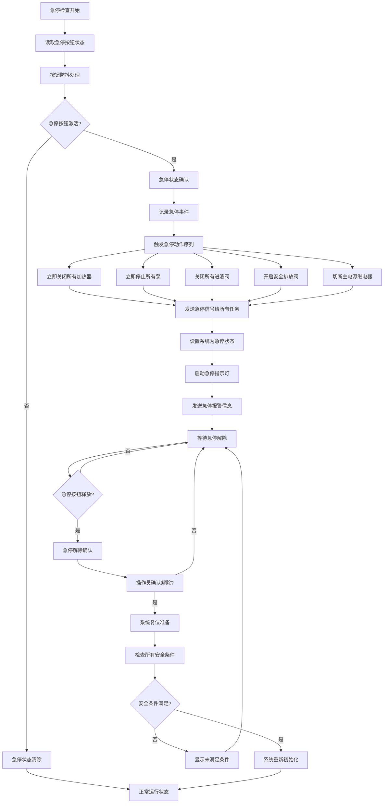
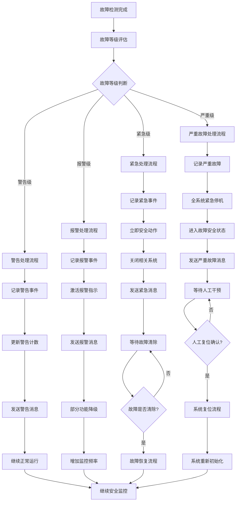
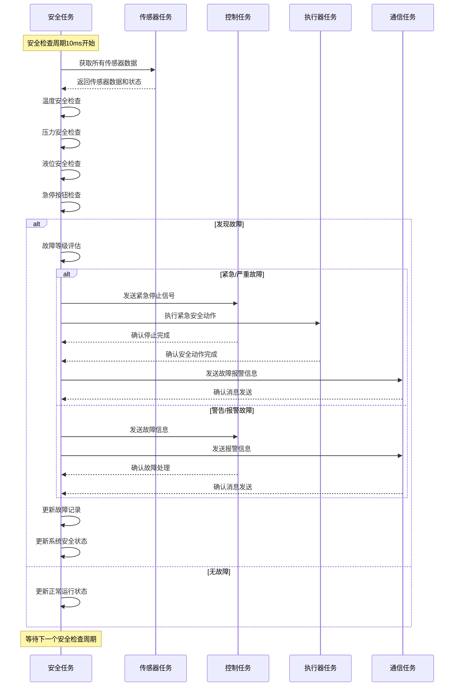

# 安全保护流程思维导图

## 1. 安全保护主流程



## 2. 温度安全检查详细流程



## 3. 压力安全检查详细流程



## 4. 液位安全检查详细流程



## 5. 急停处理流程



## 6. 故障等级处理流程



## 7. 安全任务时序图



## 8. 安全参数配置

### 8.1 温度安全限制
```c
// 温度安全参数
typedef struct {
    float max_temperature[3];      // 最大温度限制
    float min_temperature[3];      // 最小温度限制
    uint32_t temp_fault_timeout_ms; // 温度故障超时
    uint32_t temp_recovery_time_ms; // 温度恢复时间
} temperature_safety_limits_t;

const temperature_safety_limits_t temp_limits = {
    .max_temperature = {80.0f, 85.0f, 90.0f},   // 最大温度
    .min_temperature = {10.0f, 10.0f, 10.0f},   // 最小温度
    .temp_fault_timeout_ms = 1000,              // 故障超时1秒
    .temp_recovery_time_ms = 5000               // 恢复时间5秒
};
```

### 8.2 压力安全限制
```c
// 压力安全参数
typedef struct {
    float max_pressure[2];         // 最大压力限制
    float min_pressure[2];         // 最小压力限制
    uint32_t pressure_fault_timeout_ms; // 压力故障超时
    uint32_t pressure_recovery_time_ms; // 压力恢复时间
} pressure_safety_limits_t;

const pressure_safety_limits_t pressure_limits = {
    .max_pressure = {80.0f, 75.0f},            // 最大压力kPa
    .min_pressure = {5.0f, 5.0f},              // 最小压力kPa
    .pressure_fault_timeout_ms = 2000,         // 故障超时2秒
    .pressure_recovery_time_ms = 10000         // 恢复时间10秒
};
```

### 8.3 液位安全限制
```c
// 液位安全参数
typedef struct {
    float max_liquid_level[2];     // 最大液位限制
    float min_liquid_level[2];     // 最小液位限制
    uint32_t level_fault_timeout_ms; // 液位故障超时
    uint32_t level_recovery_time_ms; // 液位恢复时间
} liquid_level_safety_limits_t;

const liquid_level_safety_limits_t level_limits = {
    .max_liquid_level = {180.0f, 175.0f},      // 最大液位mm
    .min_liquid_level = {20.0f, 25.0f},        // 最小液位mm
    .level_fault_timeout_ms = 5000,            // 故障超时5秒
    .level_recovery_time_ms = 15000            // 恢复时间15秒
};
```

### 8.4 故障代码定义
```c
// 安全故障代码定义
#define SAFETY_FAULT_TEMPERATURE_HIGH_1     0x3001
#define SAFETY_FAULT_TEMPERATURE_HIGH_2     0x3002
#define SAFETY_FAULT_TEMPERATURE_HIGH_3     0x3003
#define SAFETY_FAULT_TEMPERATURE_LOW_1      0x3004
#define SAFETY_FAULT_TEMPERATURE_LOW_2      0x3005
#define SAFETY_FAULT_TEMPERATURE_LOW_3      0x3006
#define SAFETY_FAULT_PRESSURE_HIGH_1        0x3011
#define SAFETY_FAULT_PRESSURE_HIGH_2        0x3012
#define SAFETY_FAULT_PRESSURE_LOW_1         0x3013
#define SAFETY_FAULT_PRESSURE_LOW_2         0x3014
#define SAFETY_FAULT_LEVEL_HIGH_1           0x3021
#define SAFETY_FAULT_LEVEL_HIGH_2           0x3022
#define SAFETY_FAULT_LEVEL_LOW_1            0x3023
#define SAFETY_FAULT_LEVEL_LOW_2            0x3024
#define SAFETY_FAULT_EMERGENCY_STOP         0x3031
#define SAFETY_FAULT_SENSOR_TIMEOUT         0x3041
#define SAFETY_FAULT_ACTUATOR_TIMEOUT       0x3042
#define SAFETY_FAULT_COMMUNICATION_LOST     0x3051
```

---
**文档版本**: V4.0
**创建日期**: 2024-12-27
**维护者**: 供墨系统安全团队