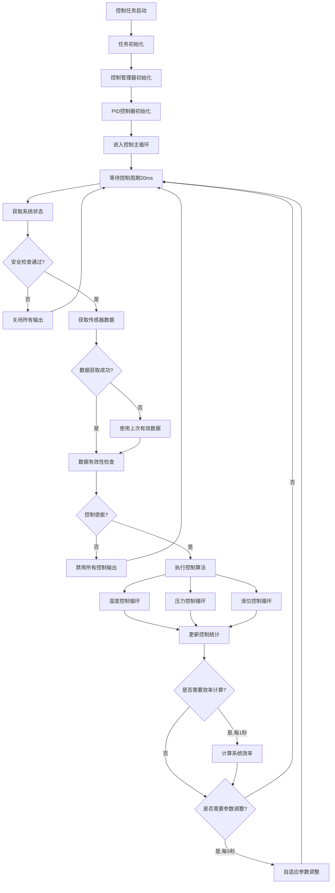
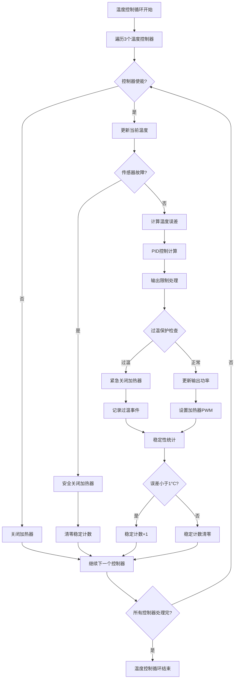
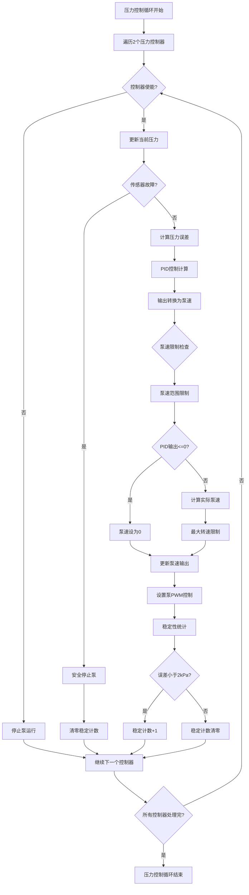
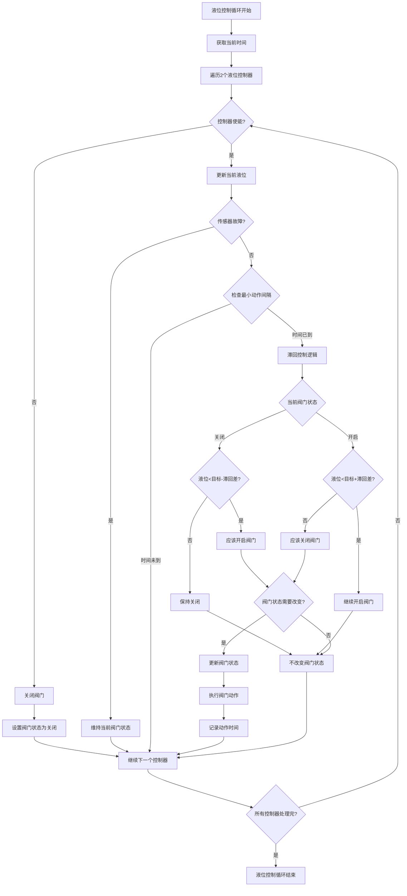
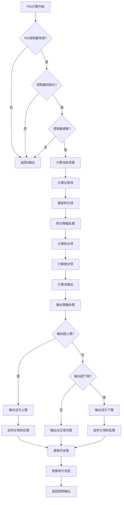
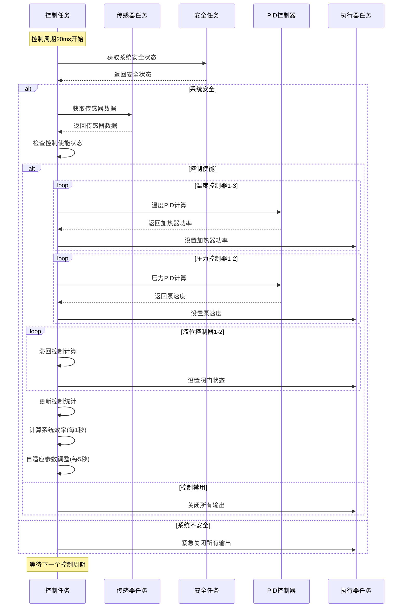

# 实时控制流程思维导图

## 1. 实时控制主流程



## 2. 温度控制详细流程



## 3. 压力控制详细流程



## 4. 液位控制详细流程



## 5. PID算法计算流程



## 6. 控制任务时序图



## 7. 关键控制参数

### 7.1 温度控制参数
```c
// 温度控制PID参数
const control_config_t temp_control_config = {
    .temperature_control = {
        .pid_params = {
            {.kp = 2.0f, .ki = 0.1f, .kd = 0.05f},  // 控制器1
            {.kp = 2.0f, .ki = 0.1f, .kd = 0.05f},  // 控制器2
            {.kp = 1.8f, .ki = 0.08f, .kd = 0.04f}  // 控制器3
        },
        .target_temps = {60.0f, 65.0f, 70.0f},       // 目标温度
        .max_powers = {100.0f, 100.0f, 80.0f},       // 最大功率
        .temp_tolerance = 2.0f,                      // 温度容差
        .overshoot_limit = 5.0f                      // 超调限制
    }
};
```

### 7.2 压力控制参数
```c
// 压力控制PID参数
const control_config_t pressure_control_config = {
    .pressure_control = {
        .pid_params = {
            {.kp = 1.5f, .ki = 0.05f, .kd = 0.02f}, // 控制器1
            {.kp = 1.5f, .ki = 0.05f, .kd = 0.02f}  // 控制器2
        },
        .target_pressures = {50.0f, 45.0f},          // 目标压力
        .max_speeds = {4500, 4000},                  // 最大泵速
        .pressure_tolerance = 5.0f,                  // 压力容差
        .min_pump_speed = 500                        // 最小泵速
    }
};
```

### 7.3 液位控制参数
```c
// 液位控制参数
const control_config_t level_control_config = {
    .level_control = {
        .target_levels = {80.0f, 75.0f},            // 目标液位
        .hysteresis = {5.0f, 5.0f},                 // 滞回差
        .min_action_interval = 2000                  // 最小动作间隔
    }
};
```

### 7.4 控制性能指标
```c
// 控制性能要求
#define TEMP_CONTROL_ACCURACY   1.0f    // 温度控制精度±1°C
#define PRESSURE_CONTROL_ACCURACY 2.0f  // 压力控制精度±2kPa
#define LEVEL_CONTROL_ACCURACY  1.0f    // 液位控制精度±1mm
#define CONTROL_SETTLING_TIME   10000   // 控制稳定时间10s
#define MAX_OVERSHOOT_PERCENT   5.0f    // 最大超调量5%
#define STEADY_STATE_ERROR      1.0f    // 稳态误差限制
```

---
**文档版本**: V4.0
**创建日期**: 2024-12-27
**维护者**: 供墨系统控制团队