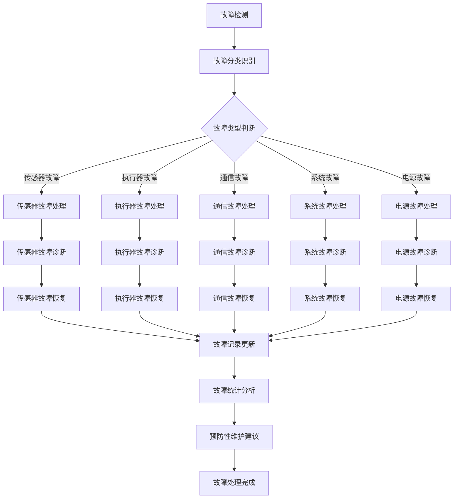
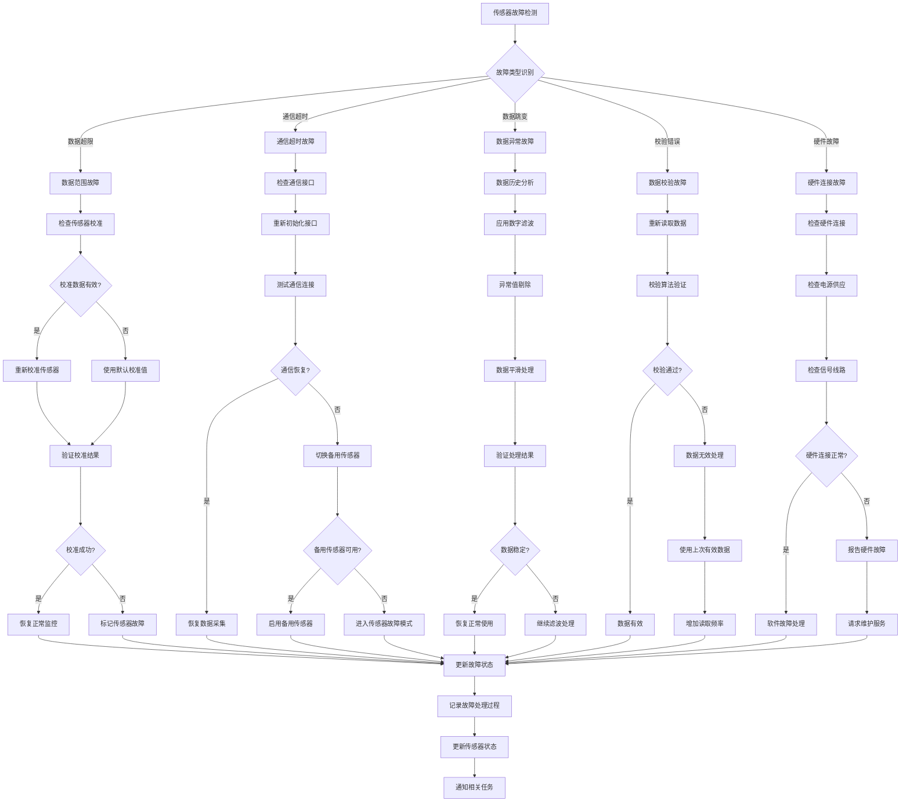
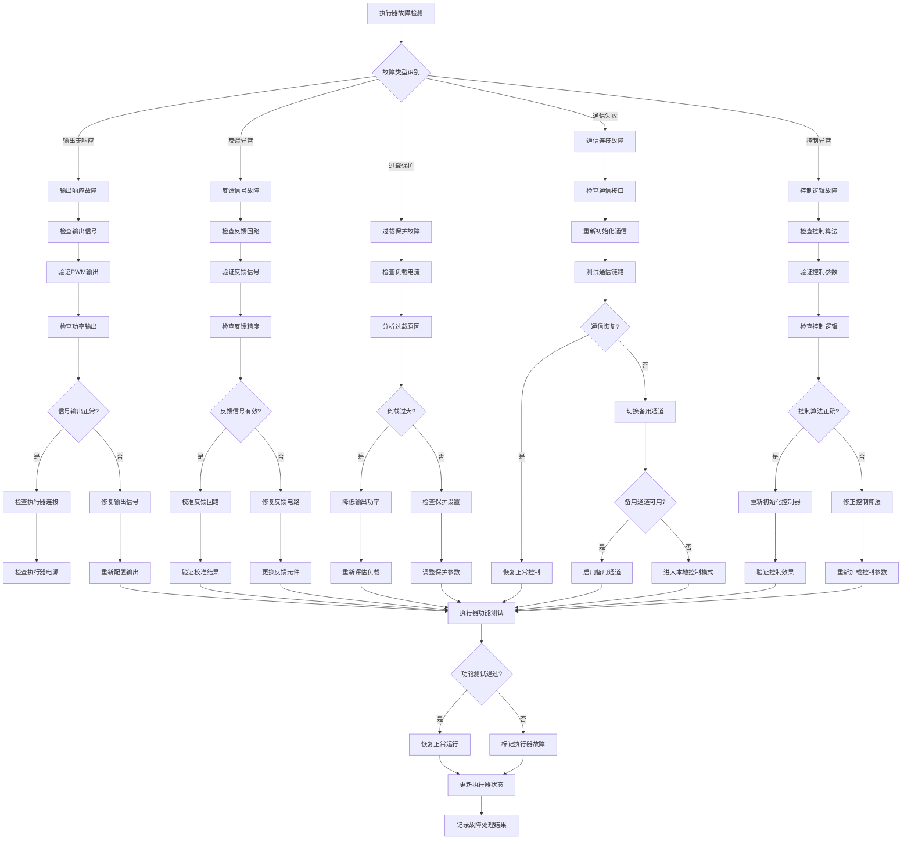
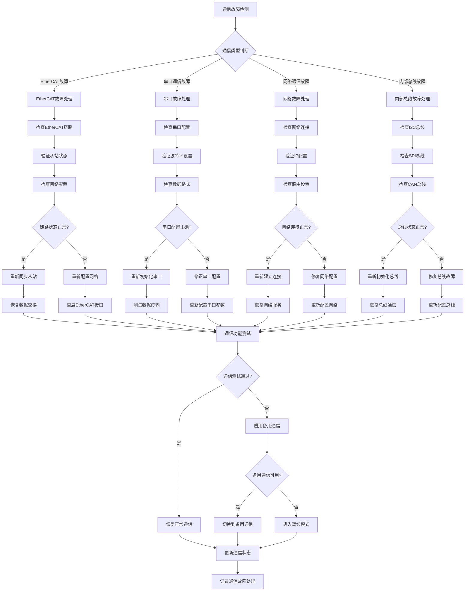
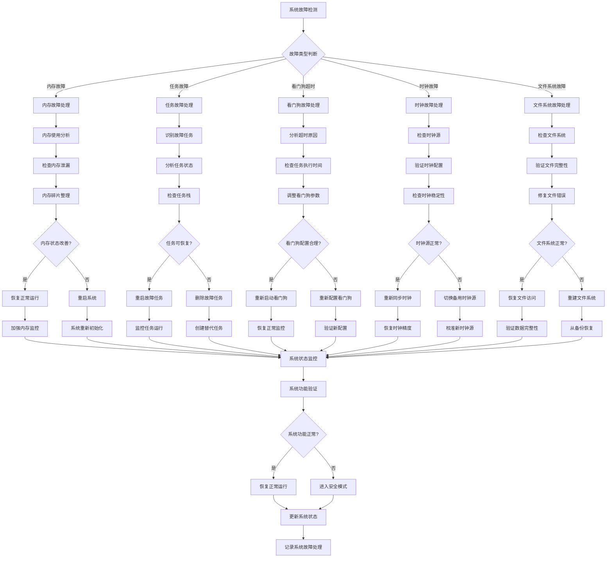
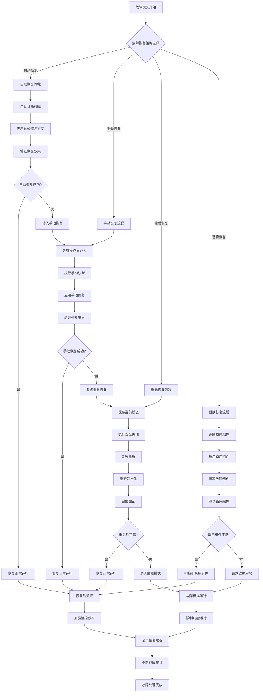
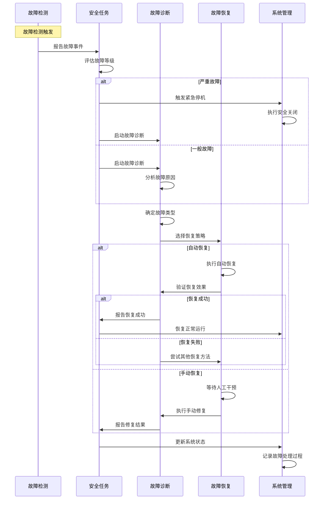

# 故障处理流程思维导图

## 1. 故障处理总体流程



## 2. 传感器故障处理详细流程



## 3. 执行器故障处理详细流程



## 4. 通信故障处理详细流程



## 5. 系统故障处理详细流程



## 6. 故障恢复策略流程



## 7. 故障处理时序图



## 8. 故障处理配置参数

### 8.1 故障检测参数
```c
// 故障检测配置
typedef struct {
    uint32_t detection_interval_ms;    // 检测间隔
    uint32_t fault_threshold_count;    // 故障计数阈值
    uint32_t recovery_timeout_ms;      // 恢复超时时间
    bool auto_recovery_enable;         // 自动恢复使能
} fault_detection_config_t;

const fault_detection_config_t fault_config = {
    .detection_interval_ms = 100,      // 检测间隔100ms
    .fault_threshold_count = 3,        // 连续3次故障确认
    .recovery_timeout_ms = 30000,      // 恢复超时30秒
    .auto_recovery_enable = true       // 启用自动恢复
};
```

### 8.2 故障恢复参数
```c
// 故障恢复配置
typedef struct {
    uint8_t max_auto_recovery_attempts;  // 最大自动恢复次数
    uint32_t recovery_interval_ms;       // 恢复间隔时间
    bool backup_system_enable;           // 备用系统使能
    uint32_t manual_intervention_timeout_ms; // 人工干预超时
} fault_recovery_config_t;

const fault_recovery_config_t recovery_config = {
    .max_auto_recovery_attempts = 3,   // 最多尝试3次自动恢复
    .recovery_interval_ms = 5000,      // 恢复间隔5秒
    .backup_system_enable = true,      // 启用备用系统
    .manual_intervention_timeout_ms = 300000 // 人工干预超时5分钟
};
```

---
**文档版本**: V4.0
**创建日期**: 2024-12-27
**维护者**: 供墨系统故障处理团队