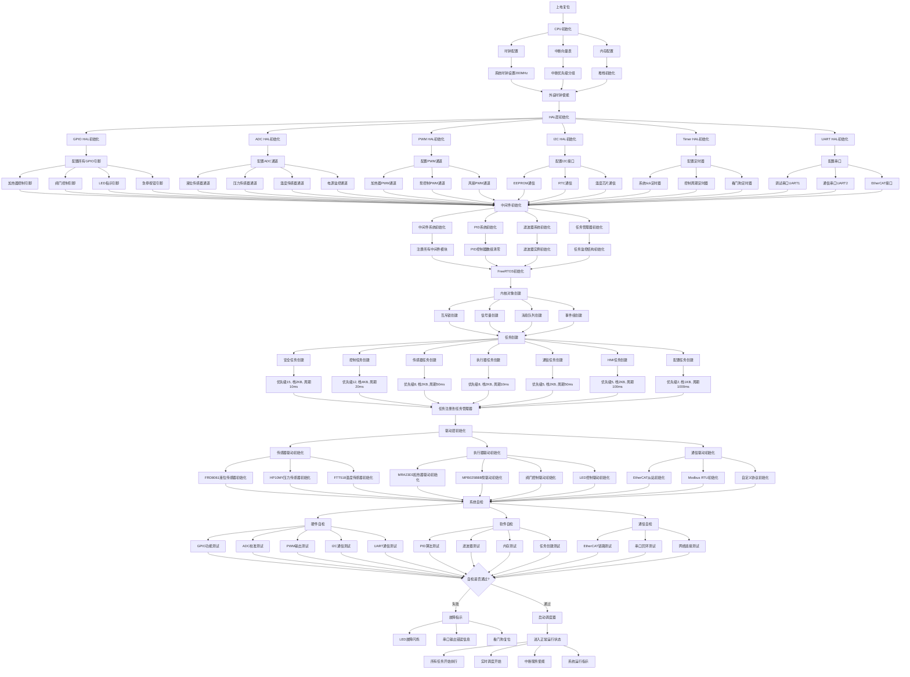
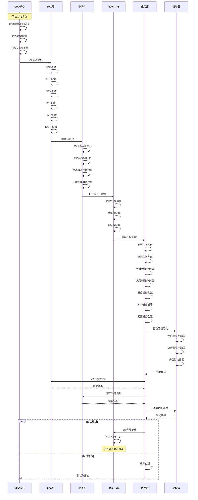

# 系统初始化流程思维导图

## 1. 详细初始化流程



## 2. 初始化时序图



## 3. 关键初始化参数

### 3.1 时钟配置参数
```c
// 时钟配置
#define SYSTEM_CLOCK_FREQ       200000000UL  // 系统时钟200MHz
#define AHB_CLOCK_FREQ          200000000UL  // AHB时钟200MHz
#define APB1_CLOCK_FREQ         100000000UL  // APB1时钟100MHz
#define APB2_CLOCK_FREQ         200000000UL  // APB2时钟200MHz
#define PLL_SOURCE_HSE          1            // PLL时钟源为外部晶振
#define HSE_VALUE               25000000UL   // 外部晶振25MHz
```

### 3.2 内存配置参数
```c
// 内存配置
#define TOTAL_HEAP_SIZE         (128 * 1024) // 总堆大小128KB
#define STACK_SIZE_LARGE        (4 * 1024)   // 大栈4KB
#define STACK_SIZE_MEDIUM       (2 * 1024)   // 中栈2KB
#define STACK_SIZE_SMALL        (1 * 1024)   // 小栈1KB
#define ISR_STACK_SIZE          (1 * 1024)   // 中断栈1KB
```

### 3.3 任务配置参数
```c
// 任务优先级配置
#define TASK_PRIORITY_CRITICAL  15  // 关键任务(安全)
#define TASK_PRIORITY_HIGH      12  // 高优先级(控制)
#define TASK_PRIORITY_NORMAL    8   // 普通优先级(传感器/执行器)
#define TASK_PRIORITY_LOW       5   // 低优先级(通信/HMI)
#define TASK_PRIORITY_BACKGROUND 2  // 后台任务(配置)

// 任务周期配置
#define SAFETY_TASK_PERIOD_MS   10   // 安全任务周期
#define CONTROL_TASK_PERIOD_MS  20   // 控制任务周期
#define SENSOR_TASK_PERIOD_MS   50   // 传感器任务周期
#define ACTUATOR_TASK_PERIOD_MS 10   // 执行器任务周期
#define COMM_TASK_PERIOD_MS     50   // 通信任务周期
#define HMI_TASK_PERIOD_MS      100  // HMI任务周期
#define CONFIG_TASK_PERIOD_MS   1000 // 配置任务周期
```

### 3.4 硬件配置参数
```c
// ADC配置
#define ADC_RESOLUTION_BITS     12          // ADC分辨率12位
#define ADC_SAMPLE_TIME_US      10          // ADC采样时间10us
#define ADC_REFERENCE_VOLTAGE   3.3f        // ADC参考电压3.3V

// PWM配置
#define PWM_FREQUENCY_HZ        10000       // PWM频率10kHz
#define PWM_RESOLUTION_BITS     16          // PWM分辨率16位
#define PWM_DEAD_TIME_NS        100         // 死区时间100ns

// I2C配置
#define I2C_SPEED_HZ            400000      // I2C速度400kHz
#define I2C_TIMEOUT_MS          100         // I2C超时100ms

// UART配置
#define UART_DEBUG_BAUDRATE     115200      // 调试串口波特率
#define UART_COMM_BAUDRATE      9600        // 通信串口波特率
```

---
**文档版本**: V4.0
**创建日期**: 2024-12-27
**维护者**: 供墨系统初始化团队