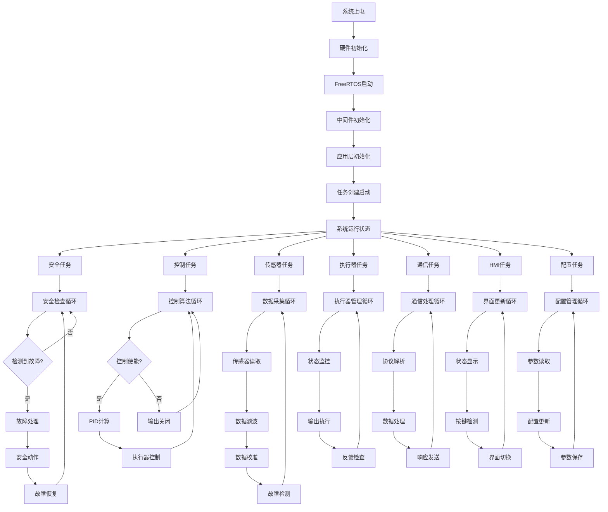

# 供墨系统运行流程思维导图

## 1. 系统总体运行流程



## 2. 详细流程说明

### 2.1 系统启动阶段
1. **上电复位** → **时钟配置** → **GPIO初始化** → **外设初始化**
2. **FreeRTOS内核启动** → **堆栈配置** → **调度器启动**
3. **中间件模块注册** → **HAL层初始化** → **驱动层初始化**
4. **应用任务创建** → **任务优先级设置** → **任务启动**

### 2.2 运行阶段
1. **多任务并发执行**
2. **实时数据采集与处理**
3. **闭环控制算法执行**
4. **安全监控与保护**
5. **通信数据交换**
6. **人机交互处理**

### 2.3 异常处理阶段
1. **故障检测与诊断**
2. **安全保护动作**
3. **系统恢复与重启**
4. **故障记录与报警**
```
