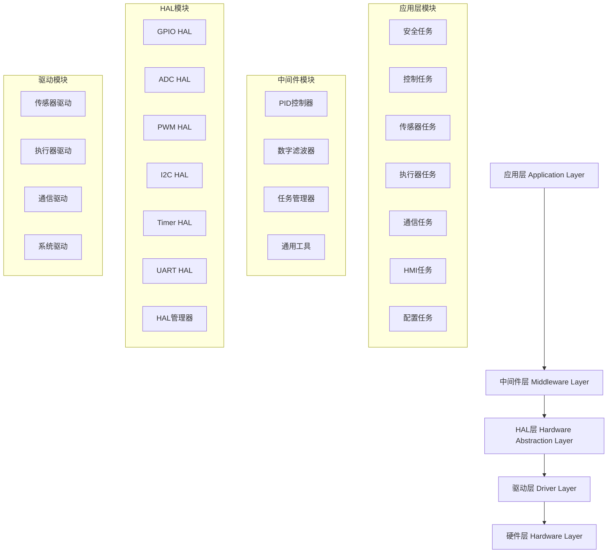

# 系统架构设计文档

## 1. 架构概述

### 1.1 架构原则
本供墨系统采用**四层分层架构**设计，遵循以下设计原则：
- **分离关注点**: 每层专注于特定的功能领域
- **依赖倒置**: 上层依赖下层的抽象接口，而非具体实现
- **高内聚低耦合**: 模块内部高度相关，模块间依赖最小化
- **可测试性**: 每层都可以独立测试和验证
- **可扩展性**: 支持新硬件和功能的平滑扩展

### 1.2 架构层次



## 2. 应用层架构

### 2.1 任务架构设计

#### 2.1.1 任务优先级分配
```
┌─────────────────┬─────────┬─────────┬─────────────┐
│   任务名称      │ 优先级  │  周期   │   功能描述   │
├─────────────────┼─────────┼─────────┼─────────────┤
│ Safety Task     │   15    │  10ms   │ 安全监控    │
│ Control Task    │   12    │  20ms   │ 控制逻辑    │
│ Sensor Task     │    8    │  50ms   │ 数据采集    │
│ Actuator Task   │    8    │  10ms   │ 执行器管理  │
│ HMI Task        │    5    │ 100ms   │ 人机交互    │
│ Comm Task       │    5    │  50ms   │ 通信处理    │
│ Config Task     │    2    │1000ms   │ 配置管理    │
└─────────────────┴─────────┴─────────┴─────────────┘
```

#### 2.1.2 任务间通信机制
```c
// 任务间通信方式
typedef enum {
    IPC_SHARED_MEMORY,      // 共享内存
    IPC_MESSAGE_QUEUE,      // 消息队列
    IPC_SEMAPHORE,         // 信号量
    IPC_EVENT_GROUP        // 事件组
} ipc_type_t;

// 共享数据保护
typedef struct {
    SemaphoreHandle_t mutex;        // 互斥锁
    uint32_t timestamp;             // 时间戳
    bool data_valid;                // 数据有效标志
} shared_data_protection_t;
```

### 2.2 安全任务架构

#### 2.2.1 安全等级定义
```c
typedef enum {
    SAFETY_LEVEL_NORMAL = 0,     // 正常运行
    SAFETY_LEVEL_WARNING,        // 警告状态
    SAFETY_LEVEL_ALARM,          // 报警状态
    SAFETY_LEVEL_EMERGENCY,      // 紧急状态
    SAFETY_LEVEL_CRITICAL        // 严重故障
} safety_level_t;
```

#### 2.2.2 安全检查项目
```
┌─────────────────┬─────────────────┬─────────────────┐
│   检查项目      │    检查频率     │   响应动作      │
├─────────────────┼─────────────────┼─────────────────┤
│ 传感器健康检查  │     10ms        │ 故障隔离        │
│ 执行器状态检查  │     10ms        │ 安全关闭        │
│ 温度过限检查    │     10ms        │ 紧急停机        │
│ 压力过限检查    │     10ms        │ 泄压保护        │
│ 液位异常检查    │     10ms        │ 阀门保护        │
│ 通信超时检查    │     50ms        │ 本地保护        │
│ 急停按钮检查    │     10ms        │ 立即停机        │
│ 看门狗检查      │     连续        │ 系统复位        │
└─────────────────┴─────────────────┴─────────────────┘
```

### 2.3 控制任务架构

#### 2.3.1 控制回路设计
```c
// 温度控制回路
typedef struct {
    pid_controller_t pid;           // PID控制器
    float target_temp;              // 目标温度
    float current_temp;             // 当前温度
    float output_power;             // 输出功率
    bool enable;                    // 使能状态
    uint32_t stable_count;          // 稳定计数
} temperature_controller_t;

// 压力控制回路
typedef struct {
    pid_controller_t pid;           // PID控制器
    float target_pressure;          // 目标压力
    float current_pressure;         // 当前压力
    uint16_t pump_speed;            // 泵转速
    bool enable;                    // 使能状态
    uint32_t stable_count;          // 稳定计数
} pressure_controller_t;

// 液位控制回路
typedef struct {
    float target_level;             // 目标液位
    float current_level;            // 当前液位
    bool valve_state;               // 阀门状态
    float hysteresis;               // 滞回差
    uint32_t last_action_time;      // 上次动作时间
} level_controller_t;
```

#### 2.3.2 控制策略
- **温度控制**: PID控制 + 前馈补偿 + 抗积分饱和
- **压力控制**: PID控制 + 速度限制 + 最小启动速度
- **液位控制**: 滞回控制 + 防抖动 + 最小动作间隔

## 3. 中间件层架构

### 3.1 PID控制器架构

#### 3.1.1 PID控制器结构
```c
typedef struct {
    // PID参数
    float kp, ki, kd;               // 比例、积分、微分系数
    float dt;                       // 采样时间

    // 控制变量
    float setpoint;                 // 设定值
    float integral;                 // 积分项
    float prev_error;               // 上次误差
    float prev_feedback;            // 上次反馈值

    // 限制参数
    float output_min, output_max;   // 输出限制
    float integral_min, integral_max; // 积分限制

    // 状态标志
    bool initialized;               // 初始化标志
    bool enabled;                   // 使能标志

    // 统计信息
    uint32_t compute_count;         // 计算次数
} pid_controller_t;
```

#### 3.1.2 PID算法特性
- **抗积分饱和**: 积分项限幅，防止积分饱和现象
- **输出限制**: 确保执行器在安全范围内工作
- **参数在线调整**: 支持运行时参数修改
- **性能统计**: 记录控制性能指标

### 3.2 数字滤波器架构

#### 3.2.1 滤波器类型
```c
typedef enum {
    FILTER_TYPE_MOVING_AVERAGE = 0,  // 移动平均滤波
    FILTER_TYPE_LOW_PASS,           // 低通滤波
    FILTER_TYPE_HIGH_PASS,          // 高通滤波
    FILTER_TYPE_BAND_PASS,          // 带通滤波
    FILTER_TYPE_MEDIAN,             // 中值滤波
    FILTER_TYPE_KALMAN              // 卡尔曼滤波
} filter_type_t;
```

#### 3.2.2 移动平均滤波器
```c
typedef struct {
    float buffer[MW_MAX_FILTER_SIZE]; // 数据缓冲区
    uint16_t size;                    // 窗口大小
    uint16_t index;                   // 当前索引
    float sum;                        // 累计和
    bool filled;                      // 缓冲区是否填满
    mw_statistics_t stats;            // 统计信息
} moving_average_filter_t;
```

### 3.3 任务管理器架构

#### 3.3.1 任务监控功能
```c
typedef struct {
    TaskHandle_t handle;            // 任务句柄
    const char* name;               // 任务名称
    task_priority_class_t priority_class; // 优先级类别
    uint32_t stack_size;            // 栈大小
    bool watchdog_enabled;          // 看门狗使能
    uint32_t watchdog_timeout_ms;   // 看门狗超时
    bool performance_monitoring;    // 性能监控使能
    task_statistics_t stats;        // 任务统计
    task_state_t state;             // 任务状态
} task_info_t;
```

#### 3.3.2 性能监控指标
- **CPU使用率**: 每个任务的CPU占用率
- **栈使用情况**: 栈高水位标记监控
- **运行时间统计**: 最大、最小、平均运行时间
- **错误统计**: 任务错误次数和类型

## 4. HAL层架构

### 4.1 HAL设计原则

#### 4.1.1 统一接口设计
```c
// 统一的结果类型
typedef enum {
    HAL_OK = 0,
    HAL_ERROR = 1,
    HAL_BUSY = 2,
    HAL_TIMEOUT = 3,
    HAL_INVALID_PARAM = 4,
    HAL_NOT_INITIALIZED = 5,
    HAL_NOT_SUPPORTED = 6,
    HAL_OUT_OF_MEMORY = 7
} hal_result_t;

// 统一的句柄结构
typedef struct {
    void* instance;                 // 硬件实例指针
    hal_state_t state;              // 状态
    hal_config_t config;            // 配置
    hal_callback_t callback;        // 回调函数
    void* user_data;                // 用户数据
    SemaphoreHandle_t mutex;        // 互斥锁
} hal_handle_t;
```

#### 4.1.2 错误处理机制
```c
// 错误信息结构
typedef struct {
    hal_result_t code;              // 错误代码
    const char* message;            // 错误描述
    const char* file;               // 发生文件
    uint32_t line;                  // 发生行号
    uint32_t timestamp;             // 时间戳
} hal_error_info_t;

// 错误处理宏
#define HAL_CHECK_PARAM(param) \
    do { if (!(param)) return HAL_INVALID_PARAM; } while(0)

#define HAL_CHECK_NULL(ptr) \
    do { if ((ptr) == NULL) return HAL_INVALID_PARAM; } while(0)
```

### 4.2 GPIO HAL架构

#### 4.2.1 GPIO功能抽象
```c
typedef enum {
    GPIO_MODE_INPUT = 0,            // 输入模式
    GPIO_MODE_OUTPUT,               // 输出模式
    GPIO_MODE_AF,                   // 复用功能
    GPIO_MODE_ANALOG,               // 模拟模式
    GPIO_MODE_IT_RISING,            // 上升沿中断
    GPIO_MODE_IT_FALLING,           // 下降沿中断
    GPIO_MODE_IT_RISING_FALLING     // 双边沿中断
} gpio_mode_t;

typedef struct {
    gpio_port_t port;               // GPIO端口
    gpio_pin_t pin;                 // GPIO引脚
    gpio_mode_t mode;               // 工作模式
    gpio_pull_t pull;               // 上下拉
    gpio_speed_t speed;             // 输出速度
} gpio_config_t;
```

#### 4.2.2 供墨系统专用接口
```c
// 加热器控制接口
hal_result_t gpio_hal_set_heater(uint8_t heater_id, bool enable);
hal_result_t gpio_hal_get_heater_state(uint8_t heater_id, bool* state);

// 阀门控制接口
hal_result_t gpio_hal_set_valve(uint8_t valve_id, bool open);
hal_result_t gpio_hal_get_valve_state(uint8_t valve_id, bool* state);

// LED控制接口
hal_result_t gpio_hal_set_led(uint8_t led_id, bool on);
hal_result_t gpio_hal_set_led_blink(uint8_t led_id, uint32_t period_ms);
```

### 4.3 ADC HAL架构

#### 4.3.1 ADC配置结构
```c
typedef struct {
    adc_instance_t instance;        // ADC实例
    adc_resolution_t resolution;    // 分辨率
    adc_trigger_t trigger;          // 触发源
    adc_mode_t mode;                // 工作模式
    uint32_t sample_time;           // 采样时间
    bool dma_enable;                // DMA使能
    bool continuous_mode;           // 连续模式
} adc_config_t;
```

#### 4.3.2 传感器专用接口
```c
// 液位传感器读取
hal_result_t adc_hal_read_liquid_level(uint8_t sensor_id, float* level_mm);

// 压力传感器读取
hal_result_t adc_hal_read_pressure(uint8_t sensor_id, float* pressure_kpa);

// 温度传感器读取（PT100）
hal_result_t adc_hal_read_temperature_pt100(uint8_t sensor_id, float* temp_c, float* resistance_ohm);

// 电压监控
hal_result_t adc_hal_read_supply_voltage(adc_supply_type_t type, float* voltage_v);
```

### 4.4 PWM HAL架构

#### 4.4.1 PWM配置结构
```c
typedef struct {
    pwm_timer_t timer;              // 定时器实例
    pwm_channel_t channel;          // PWM通道
    uint32_t frequency;             // PWM频率
    uint16_t duty_cycle;            // 占空比(0-10000)
    pwm_polarity_t polarity;        // 极性
    bool dead_time_enable;          // 死区时间使能
    uint16_t dead_time_ns;          // 死区时间
} pwm_config_t;
```

#### 4.4.2 执行器专用接口
```c
// 加热器功率控制
hal_result_t pwm_hal_set_heater_power(uint8_t heater_id, float power_percent);

// 泵速度控制
hal_result_t pwm_hal_set_pump_speed(uint8_t pump_id, uint16_t speed_percent);

// 风扇速度控制
hal_result_t pwm_hal_set_fan_speed(uint8_t fan_id, uint16_t speed_percent);

// PWM频率测量
hal_result_t pwm_hal_measure_frequency(pwm_channel_t channel, float* frequency_hz);
```

## 5. 驱动层架构

### 5.1 传感器驱动架构

#### 5.1.1 传感器驱动接口
```c
// 传感器驱动通用接口
typedef struct {
    const char* name;               // 传感器名称
    sensor_type_t type;             // 传感器类型
    hal_result_t (*init)(void);     // 初始化函数
    hal_result_t (*read)(float* value); // 读取函数
    hal_result_t (*calibrate)(float ref); // 校准函数
    hal_result_t (*self_test)(void); // 自检函数
    hal_result_t (*reset)(void);    // 复位函数
} sensor_driver_t;
```

#### 5.1.2 具体传感器驱动

**FRD-8061液位传感器驱动**
```c
// 4-20mA信号转换为液位值
hal_result_t frd8061_read_level(uint8_t sensor_id, float* level_mm);
hal_result_t frd8061_calibrate(uint8_t sensor_id, float actual_level_mm);
hal_result_t frd8061_set_range(uint8_t sensor_id, float max_level_mm);
```

**HP10MY压力传感器驱动**
```c
// 4-20mA信号转换为压力值
hal_result_t hp10my_read_pressure(uint8_t sensor_id, float* pressure_kpa);
hal_result_t hp10my_calibrate(uint8_t sensor_id, float actual_pressure_kpa);
hal_result_t hp10my_set_range(uint8_t sensor_id, float max_pressure_kpa);
```

**FTT518温度传感器驱动**
```c
// PT100电阻转换为温度值
hal_result_t ftt518_read_temperature(uint8_t sensor_id, float* temp_c);
hal_result_t ftt518_read_resistance(uint8_t sensor_id, float* resistance_ohm);
hal_result_t ftt518_calibrate(uint8_t sensor_id, float actual_temp_c);
```

### 5.2 执行器驱动架构

#### 5.2.1 执行器驱动接口
```c
// 执行器驱动通用接口
typedef struct {
    const char* name;               // 执行器名称
    actuator_type_t type;           // 执行器类型
    hal_result_t (*init)(void);     // 初始化函数
    hal_result_t (*set_output)(float value); // 设置输出
    hal_result_t (*get_status)(actuator_status_t* status); // 获取状态
    hal_result_t (*enable)(bool enable); // 使能控制
    hal_result_t (*self_test)(void); // 自检函数
} actuator_driver_t;
```

#### 5.2.2 具体执行器驱动

**MRA-23D3加热器驱动**
```c
// PWM控制加热器功率
hal_result_t mra23d3_set_power(uint8_t heater_id, float power_percent);
hal_result_t mra23d3_get_temperature(uint8_t heater_id, float* temp_c);
hal_result_t mra23d3_enable(uint8_t heater_id, bool enable);
hal_result_t mra23d3_get_fault_status(uint8_t heater_id, bool* fault);
```

**MPB025BBB泵驱动**
```c
// PWM控制泵转速
hal_result_t mpb025bbb_set_speed(uint8_t pump_id, uint16_t speed_rpm);
hal_result_t mpb025bbb_get_speed(uint8_t pump_id, uint16_t* speed_rpm);
hal_result_t mpb025bbb_get_flow_rate(uint8_t pump_id, float* flow_rate);
hal_result_t mpb025bbb_enable(uint8_t pump_id, bool enable);
```

**电磁阀驱动**
```c
// GPIO控制阀门开关
hal_result_t valve_set_state(uint8_t valve_id, bool open);
hal_result_t valve_get_state(uint8_t valve_id, bool* open);
hal_result_t valve_get_switch_count(uint8_t valve_id, uint32_t* count);
```

## 6. 通信架构

### 6.1 通信协议栈

#### 6.1.1 EtherCAT通信架构
```c
// EtherCAT从站配置
typedef struct {
    uint16_t vendor_id;             // 厂商ID
    uint32_t product_code;          // 产品代码
    uint32_t revision_number;       // 版本号
    uint32_t serial_number;         // 序列号
    uint16_t station_alias;         // 站点别名
    ec_state_t state;               // EtherCAT状态
} ethercat_config_t;

// 过程数据对象(PDO)
typedef struct {
    // 输入PDO (从站到主站)
    struct {
        float liquid_level[2];      // 液位数据
        float pressure[2];          // 压力数据
        float temperature[3];       // 温度数据
        uint16_t status_word;       // 状态字
        uint16_t fault_code;        // 故障代码
    } input_pdo;

    // 输出PDO (主站到从站)
    struct {
        float heater_power[3];      // 加热器功率
        uint16_t pump_speed[2];     // 泵转速
        uint16_t valve_control;     // 阀门控制
        uint16_t control_word;      // 控制字
    } output_pdo;
} ethercat_pdo_t;
```

#### 6.1.2 串口通信架构
```c
// Modbus RTU协议
typedef struct {
    uint8_t slave_address;          // 从站地址
    uint8_t function_code;          // 功能码
    uint16_t register_address;      // 寄存器地址
    uint16_t register_count;        // 寄存器数量
    uint16_t crc;                   // CRC校验
} modbus_frame_t;

// 自定义协议
typedef struct {
    uint8_t header[2];              // 帧头 0xAA, 0x55
    uint8_t command;                // 命令字
    uint8_t length;                 // 数据长度
    uint8_t data[256];              // 数据域
    uint8_t checksum;               // 校验和
} custom_frame_t;
```

## 7. 数据流架构

### 7.1 数据流向图
```
传感器硬件 → 驱动层 → HAL层 → 中间件层(滤波) → 应用层(控制) → 中间件层(PID) → HAL层 → 驱动层 → 执行器硬件
     ↓           ↓        ↓           ↓              ↓             ↓           ↓        ↓          ↓
   原始信号  → 数字转换 → 标准化 → 滤波处理 → 控制算法 → PID输出 → PWM信号 → 功率控制 → 物理输出
```

### 7.2 数据处理流程

#### 7.2.1 传感器数据流
```c
// 数据处理流程
typedef struct {
    float raw_value;                // 原始ADC值
    float engineering_value;        // 工程量值
    float filtered_value;           // 滤波后值
    float calibrated_value;         // 校准后值
    bool data_valid;                // 数据有效标志
    uint32_t timestamp;             // 时间戳
    sensor_quality_t quality;       // 数据质量
} sensor_data_flow_t;
```

#### 7.2.2 控制输出流
```c
// 控制输出流程
typedef struct {
    float setpoint;                 // 设定值
    float process_value;            // 过程值
    float error;                    // 误差
    float pid_output;               // PID输出
    float limited_output;           // 限幅后输出
    float final_output;             // 最终输出
    bool output_valid;              // 输出有效标志
    control_mode_t mode;            // 控制模式
} control_data_flow_t;
```

## 8. 安全架构

### 8.1 安全设计原则
- **故障安全**: 系统故障时自动进入安全状态
- **多重保护**: 多层次、多维度的安全保护
- **快速响应**: 安全事件的快速检测和响应
- **状态监控**: 实时监控系统运行状态
- **故障隔离**: 故障点的快速定位和隔离

### 8.2 安全功能架构

#### 8.2.1 硬件安全
```c
// 硬件看门狗
typedef struct {
    uint32_t timeout_ms;            // 超时时间
    bool enable;                    // 使能标志
    wdt_mode_t mode;                // 工作模式
    wdt_prescaler_t prescaler;      // 预分频器
} hardware_watchdog_t;

// 急停按钮
typedef struct {
    gpio_pin_t pin;                 // GPIO引脚
    bool active_level;              // 有效电平
    uint32_t debounce_time_ms;      // 去抖时间
    emergency_action_t action;      // 急停动作
} emergency_stop_t;
```

#### 8.2.2 软件安全
```c
// 软件看门狗
typedef struct {
    const char* task_name;          // 任务名称
    uint32_t timeout_ms;            // 超时时间
    uint32_t last_feed_time;        // 上次喂狗时间
    bool enable;                    // 使能标志
    watchdog_action_t action;       // 超时动作
} software_watchdog_t;

// 安全状态机
typedef struct {
    safety_state_t current_state;   // 当前状态
    safety_state_t prev_state;      // 前一状态
    uint32_t state_enter_time;      // 状态进入时间
    safety_event_t trigger_event;   // 触发事件
    bool state_changed;             // 状态改变标志
} safety_state_machine_t;
```

## 9. 性能架构

### 9.1 实时性保证

#### 9.1.1 任务调度策略
```c
// 实时任务配置
typedef struct {
    uint8_t priority;               // 任务优先级
    uint32_t period_ms;             // 任务周期
    uint32_t deadline_ms;           // 截止时间
    uint32_t wcet_ms;               // 最坏执行时间
    scheduling_policy_t policy;     // 调度策略
} real_time_task_config_t;
```

#### 9.1.2 中断优先级配置
```c
// 中断优先级分配
#define IRQ_PRIORITY_EMERGENCY      0    // 紧急中断(急停)
#define IRQ_PRIORITY_SAFETY         1    // 安全中断(过温,过压)
#define IRQ_PRIORITY_CONTROL        2    // 控制中断(定时器)
#define IRQ_PRIORITY_COMMUNICATION  3    // 通信中断
#define IRQ_PRIORITY_PERIPHERAL     4    // 外设中断
#define IRQ_PRIORITY_BACKGROUND     5    // 后台中断
```

### 9.2 内存管理

#### 9.2.1 内存分区
```c
// 内存分区配置
typedef struct {
    void* start_address;            // 起始地址
    size_t size;                    // 分区大小
    memory_type_t type;             // 内存类型
    memory_protection_t protection; // 保护级别
    bool cacheable;                 // 是否可缓存
} memory_region_t;

// 内存池管理
typedef struct {
    void* pool_start;               // 内存池起始地址
    size_t pool_size;               // 内存池大小
    size_t block_size;              // 块大小
    uint32_t total_blocks;          // 总块数
    uint32_t free_blocks;           // 空闲块数
    uint8_t* free_list;             // 空闲列表
} memory_pool_t;
```

### 9.3 性能监控

#### 9.3.1 性能指标
```c
// 系统性能指标
typedef struct {
    float cpu_usage_percent;        // CPU使用率
    uint32_t free_heap_size;        // 空闲堆大小
    uint32_t min_free_heap_size;    // 最小空闲堆
    uint32_t max_task_runtime_us;   // 最大任务运行时间
    uint32_t context_switch_count;  // 上下文切换次数
    uint32_t interrupt_count;       // 中断次数
    float temperature_c;            // CPU温度
} system_performance_t;
```

---
**文档版本**: V4.0
**创建日期**: 2024-12-27
**维护者**: 供墨系统架构团队