# 通信处理流程思维导图

## 1. 通信处理总体流程


## 2. EtherCAT通信详细流程


## 3. Modbus RTU通信详细流程

```mermaid
graph TD
    A[Modbus通信开始] --> B[监听串口数据]
    B --> C{接收到数据?}

    C -->|否| D[检查超时]
    D --> E{通信超时?}
    E -->|是| F[清空接收缓冲区]
    E -->|否| B
    F --> B

    C -->|是| G[接收Modbus帧]
    G --> H[帧完整性检查]
    H --> I{帧完整?}

    I -->|否| J[等待更多数据]
    J --> K{接收超时?}
    K -->|是| L[丢弃不完整帧]
    K -->|否| G
    L --> B

    I -->|是| M[CRC校验]
    M --> N{CRC正确?}

    N -->|否| O[发送错误响应]
    O --> B

    N -->|是| P[解析从站地址]
    P --> Q{地址匹配?}

    Q -->|否| R[忽略帧]
    R --> B

    Q -->|是| S[解析功能码]
    S --> T{功能码识别}

    T -->|读保持寄存器(03)| U[读寄存器处理]
    T -->|写单个寄存器(06)| V[写单个寄存器处理]
    T -->|写多个寄存器(16)| W[写多个寄存器处理]
    T -->|读输入寄存器(04)| X[读输入寄存器处理]
    T -->|其他功能码| Y[不支持功能码错误]

    U --> U1[验证寄存器地址]
    U1 --> U2{地址有效?}
    U2 -->|否| U3[发送地址错误响应]
    U2 -->|是| U4[读取寄存器数据]
    U4 --> U5[构造读响应帧]

    V --> V1[验证寄存器地址]
    V1 --> V2{地址有效?}
    V2 -->|否| V3[发送地址错误响应]
    V2 -->|是| V4[写入寄存器数据]
    V4 --> V5[构造写响应帧]

    W --> W1[验证寄存器地址范围]
    W1 --> W2{地址范围有效?}
    W2 -->|否| W3[发送地址错误响应]
    W2 -->|是| W4[批量写入寄存器]
    W4 --> W5[构造写响应帧]

    X --> X1[验证输入寄存器地址]
    X1 --> X2{地址有效?}
    X2 -->|否| X3[发送地址错误响应]
    X2 -->|是| X4[读取输入寄存器]
    X4 --> X5[构造读响应帧]

    Y --> Y1[构造不支持功能码错误响应]

    U3 --> Z[发送响应帧]
    U5 --> Z
    V3 --> Z
    V5 --> Z
    W3 --> Z
    W5 --> Z
    X3 --> Z
    X5 --> Z
    Y1 --> Z

    Z --> AA[更新通信统计]
    AA --> B
```

## 4. 网络通信详细流程

```mermaid
graph TD
    A[网络通信开始] --> B[初始化TCP/UDP套接字]
    B --> C[绑定监听端口]
    C --> D[进入网络监听循环]

    D --> E{有新连接?}
    E -->|TCP连接| F[接受TCP连接]
    E -->|UDP数据| G[接收UDP数据]
    E -->|无数据| H[检查现有连接]

    F --> F1[验证客户端地址]
    F1 --> F2{客户端授权?}
    F2 -->|否| F3[拒绝连接]
    F2 -->|是| F4[建立TCP连接]
    F3 --> D
    F4 --> I[处理TCP数据]

    G --> G1[验证UDP来源]
    G1 --> G2{来源授权?}
    G2 -->|否| G3[丢弃UDP包]
    G2 -->|是| G4[处理UDP数据]
    G3 --> D
    G4 --> J[解析UDP命令]

    H --> H1[检查连接状态]
    H1 --> H2{连接活跃?}
    H2 -->|否| H3[清理无效连接]
    H2 -->|是| H4[处理连接数据]
    H3 --> D
    H4 --> I

    I --> I1[接收TCP数据]
    I1 --> I2[数据完整性检查]
    I2 --> I3{数据完整?}
    I3 -->|否| I4[等待更多数据]
    I3 -->|是| I5[解析TCP命令]
    I4 --> I1

    I5 --> K[命令类型识别]
    J --> K

    K --> K1{命令类型}
    K1 -->|状态查询| L[系统状态查询处理]
    K1 -->|参数设置| M[参数设置处理]
    K1 -->|数据订阅| N[数据订阅处理]
    K1 -->|固件升级| O[固件升级处理]
    K1 -->|文件传输| P[文件传输处理]

    L --> L1[收集系统状态]
    L1 --> L2[格式化状态数据]
    L2 --> L3[构造状态响应]

    M --> M1[验证参数范围]
    M1 --> M2{参数有效?}
    M2 -->|否| M3[构造参数错误响应]
    M2 -->|是| M4[更新系统参数]
    M4 --> M5[构造设置成功响应]

    N --> N1[建立数据订阅]
    N1 --> N2[配置推送频率]
    N2 --> N3[启动数据推送]

    O --> O1[验证固件文件]
    O1 --> O2{文件有效?}
    O2 -->|否| O3[拒绝固件升级]
    O2 -->|是| O4[启动固件升级流程]

    P --> P1[文件传输协议处理]
    P1 --> P2[文件完整性验证]
    P2 --> P3[文件存储处理]

    L3 --> Q[发送响应数据]
    M3 --> Q
    M5 --> Q
    N3 --> R[定期推送数据]
    O3 --> Q
    O4 --> S[固件升级流程]
    P3 --> Q

    Q --> T[更新网络统计]
    R --> T
    S --> U[系统重启]
    T --> D
    U --> A
```



## 5. 数据交换映射流程


## 6. 通信故障处理流程


## 7. 通信任务时序图


## 8. 通信配置参数

### 8.1 EtherCAT配置参数
```c
// EtherCAT配置
typedef struct {
    uint16_t vendor_id;             // 厂商ID
    uint32_t product_code;          // 产品代码
    uint32_t revision_number;       // 版本号
    uint32_t serial_number;         // 序列号
    uint16_t station_alias;         // 站点别名
    uint32_t cycle_time_us;         // 循环时间
} ethercat_config_t;

const ethercat_config_t ethercat_cfg = {
    .vendor_id = 0x12345678,        // 供墨系统厂商ID
    .product_code = 0x87654321,     // 产品代码
    .revision_number = 0x00040000,  // 版本V4.0
    .serial_number = 0x00000001,    // 序列号
    .station_alias = 1000,          // 站点别名
    .cycle_time_us = 1000           // 1ms循环时间
};
```

### 8.2 Modbus配置参数
```c
// Modbus配置
typedef struct {
    uint8_t slave_address;          // 从站地址
    uint32_t baudrate;              // 波特率
    uint8_t data_bits;              // 数据位
    uint8_t stop_bits;              // 停止位
    char parity;                    // 奇偶校验
    uint32_t timeout_ms;            // 超时时间
} modbus_config_t;

const modbus_config_t modbus_cfg = {
    .slave_address = 1,             // 从站地址1
    .baudrate = 9600,               // 波特率9600
    .data_bits = 8,                 // 8数据位
    .stop_bits = 1,                 // 1停止位
    .parity = 'N',                  // 无奇偶校验
    .timeout_ms = 1000              // 超时1秒
};
```

### 8.3 网络配置参数
```c
// 网络配置
typedef struct {
    uint32_t ip_address;            // IP地址
    uint32_t subnet_mask;           // 子网掩码
    uint32_t gateway;               // 网关地址
    uint16_t tcp_port;              // TCP端口
    uint16_t udp_port;              // UDP端口
    uint32_t connect_timeout_ms;    // 连接超时
} network_config_t;

const network_config_t network_cfg = {
    .ip_address = 0xC0A80164,       // 192.168.1.100
    .subnet_mask = 0xFFFFFF00,      // 255.255.255.0
    .gateway = 0xC0A80101,          // 192.168.1.1
    .tcp_port = 502,                // Modbus TCP端口
    .udp_port = 5000,               // 自定义UDP端口
    .connect_timeout_ms = 5000      // 连接超时5秒
};
```

---
**文档版本**: V4.0
**创建日期**: 2024-12-27
**维护者**: 供墨系统通信团队